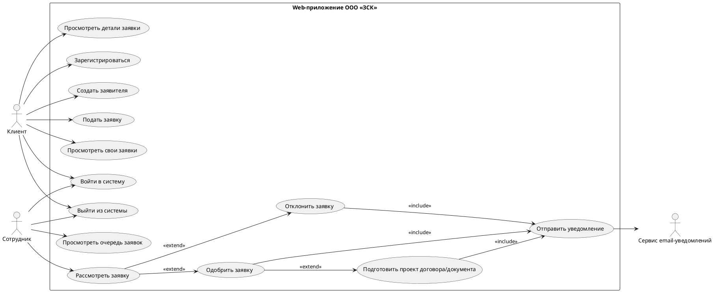

# Use Case Diagrams Plan

Status: draft  
Scope: Use Case diagrams and explanatory text for VKR chapter 2

Use Case diagrams show who interacts with the system and what actions are available. They do not replace textual scenario specifications.

## 1. Diagram Set

```text
1. General system Use Case diagram.
2. Client Use Case diagram.
3. Employee Use Case diagram.
4. Document and notification Use Case diagram.
```

## 2. General Use Case Diagram

Actors:

```text
- Клиент
- Сотрудник
- Сервис email-уведомлений
```

Use cases:

```text
- Зарегистрироваться
- Войти в систему
- Выйти из системы
- Создать заявителя
- Подать заявку
- Просмотреть свои заявки
- Просмотреть детали заявки
- Просмотреть очередь заявок
- Рассмотреть заявку
- Одобрить заявку
- Отклонить заявку
- Подготовить проект договора/документа
- Отправить уведомление
```

Suggested PlantUML draft:



## 3. Explanatory Text Under The Diagram

```text
На диаграмме показаны основные акторы системы: клиент, сотрудник сетевой компании и сервис email-уведомлений. Клиент выполняет регистрацию, вход в систему, создание заявителя, подачу заявки и просмотр собственных заявок. Сотрудник работает с очередью заявок, рассматривает данные, принимает решение об одобрении или отклонении и при необходимости подготавливает проект договора или связанного документа. Сервис email-уведомлений используется для уведомления клиента о результате обработки или готовности документа.
```

## 4. Employee Diagram Note

Use the employee diagram to show that approval and document preparation are related but separate actions. This supports the architecture decision not to auto-create an agreement proposal during approval unless the final business rule explicitly requires it.
