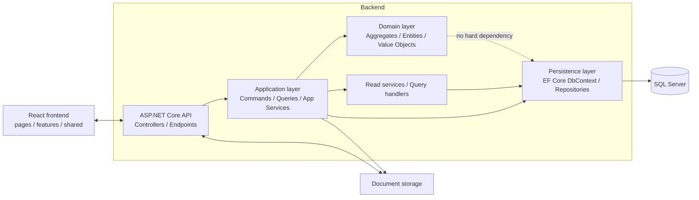
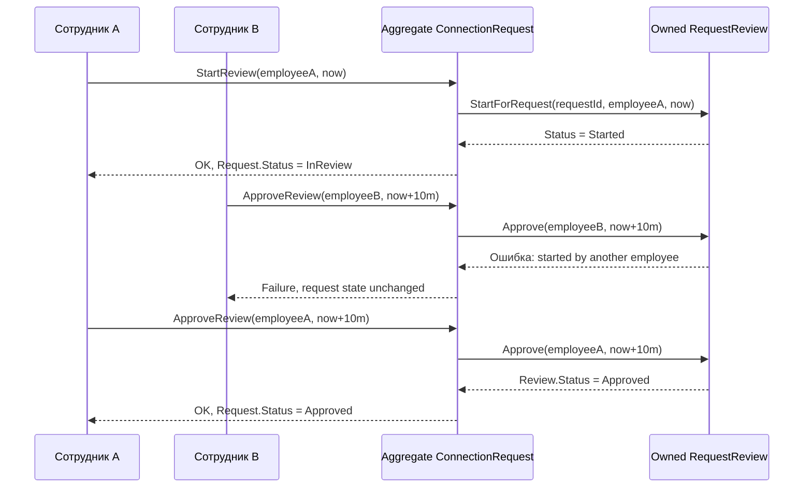
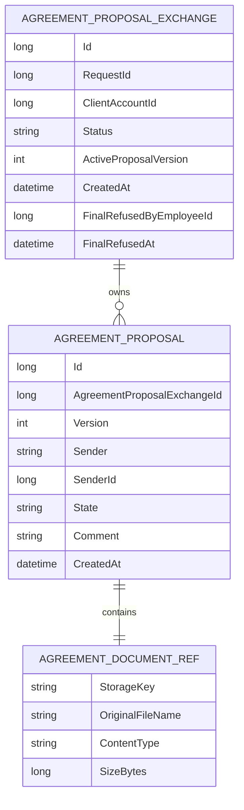

# Архитектурные подходы для главы ВКР в проекте enman

## Executive summary

Для рассматриваемого проекта на стеке ASP.NET Core, EF Core и React наилучшим решением выглядит не «полное DDD» и не «полный CQRS», а **мягкий, избирательный DDD-подход**: богатая предметная модель — только там, где действительно есть сильные инварианты и согласованное изменение состояния; на чтении — специализированные query/read-сервисы и DTO; на уровне организации кода — **vertical slices** на backend и **FSD-lite** на frontend. Такой выбор лучше всего сочетает требования к тестируемости, расширяемости и объяснимости архитектуры в тексте ВКР с осторожной позицией Фаулера по отношению к CQRS, практическими рекомендациями Microsoft по упрощённому CQRS и DDD, а также с более прагматичной линией Кhorikov по изоляции доменной модели и always-valid domain model. citeturn35search0turn35search1turn35search21turn32search0turn34search1turn34search6turn33search7

Репозиторий уже частично движется именно в эту сторону. В нём выделены самостоятельные области `Application`, `Controllers`, `Persistence`, отдельный доменный проект и отдельные domain/integration tests; контроллеры dispatch-ят команды и запросы через `ISender`, а планировочная документация явно вводит сценарии, behavior items, slices и трассировку поведения к тестам. Это означает, что для дипломной главы разумно описывать архитектуру не как «абстрактный Clean Architecture из учебника», а как **гибрид: независимый domain + command/query organization + scenario-driven slices**. citeturn12view0turn12view1turn12view2turn12view4turn17view0turn18view0turn28view0turn30view0

С точки зрения агрегатов текущая предметная область уже подсказывает хорошие границы. `ConnectionRequest` должен оставаться **aggregate root**, владеющим `RequestReview`, потому что состояния заявки и ревью изменяются атомарно в одном методе и покрыты общими инвариантами. Аналогично `AgreementProposalExchange` является естественным агрегатом для коллекции предложений и активной версии предложения: именно root управляет переходами статусов, сменой активной версии и финальным отказом. citeturn9view0turn9view1turn9view3turn10view0turn25view8turn24view2

Самое важное практическое следствие для EF Core и доменной модели такое: **не опираться в инвариантах на DB-generated id дочерних объектов**. В текущем коде это уже частично исправлено: агрегат `AgreementProposalExchange` использует `ActiveProposalVersion`, а не `ActiveProposalId`, тогда как `AgreementProposal.Id` генерируется базой через `ValueGeneratedOnAdd`. Это хорошее направление: внутри агрегата доменной идентичностью предложения должна быть версия, а суррогатный `Id` — оставаться технической деталью persistence/read-model. citeturn9view3turn10view0turn21view0

По EF Core текущая модель тоже выглядит прагматично: наследование `ApplicantParty` и `ClientRequest` уже настроено через discriminator, то есть через **TPH**, а value objects и зависимые части агрегатов маппятся через `OwnsOne`/`OwnsMany`. Для данного проекта это оправдано: TPH — дефолтная стратегия EF Core и, как правило, более выгодна по производительности, чем TPT; complex types в EF8 можно применять точечно для чистых value objects без собственной идентичности, но не для всего подряд. citeturn20view4turn20view8turn21view2turn41view0turn42view0turn42view1turn38search5

Практическая рекомендация для проекта в двух словах: **сохранить независимый domain и simplified CQRS, довести backend до vertical slices по use case, оставить Review дочерним объектом Request, оставить Proposal дочерним объектом AgreementProposalExchange, не внедрять отдельный read-store и event sourcing на текущем этапе, а на frontend применять FSD как организационный принцип, но без догматизма**. citeturn35search0turn35search1turn36search0turn37search0turn36search1turn43search0turn43search4

## Контекст проекта и что уже хорошо с архитектурной точки зрения

Репозиторий фактически уже разделён на слои и роли: серверная часть содержит `Application`, `Controllers`, `Persistence`, а тестовый контур разделён на `Domain` и `Integration`. Одновременно planning-структура описывает не только код, но и сценарии, behavior items, slices, диаграммы и трассировку в тесты. Для главы ВКР это сильная сторона: можно показать, что архитектура проекта выведена из сценариев и инвариантов, а не только из выбранных фреймворков. citeturn12view0turn12view1turn12view2turn12view3turn12view4turn28view0turn30view0turn31view4

В planning-документации прямо зафиксировано, что сценарные источники описывают требуемое поведение, а slice-документы определяют, **какая часть поведения реализуется, как она реализуется и как проверяется**. Также отдельно подчёркивается, что slice — это граница ответственности, но **не обязательно строго вертикальная сквозная цепочка через все слои**. Это важная и зрелая мысль, потому что она снимает ложную дилемму «либо чистые слои, либо чистые вертикальные срезы»: на практике для сложного монолита они могут сосуществовать. citeturn28view0turn30view0

На уровне серверного API проект уже демонстрирует признаки упрощённого CQRS: в `EmployeeRequestsController` списки и детали обрабатываются как запросы, а `start/approve/reject` — как команды; в `AgreementExchangesController` чтение списка и деталей вынесено в read-service/query path, а изменения выполняются через application service. Это не «полный CQRS» с двумя независимыми хранилищами, но это уже корректное **разделение read/write responsibility**, которое можно и нужно описывать в тексте диплома как выбранный архитектурный компромисс. citeturn17view0turn18view0turn35search0turn35search1turn35search21

Наконец, проект важен не только кодовой, но и исследовательской дисциплиной: планировочная папка содержит workflow текущего состояния, таблицы покрытия поведения, UI-планирование и тезисные правила ВКР. Это позволяет во второй главе диплома показать архитектуру **как систему решений и артефактов**, а не как набор папок. citeturn8view4turn8view5turn29view1turn31view2turn29view2

Ниже приведена рекомендуемая схема, которую можно использовать в главе ВКР как итоговую архитектурную диаграмму проекта. Она соотносится и с текущей структурой репозитория, и с выбранным набором подходов. citeturn12view0turn12view1turn12view2turn17view0turn18view0turn39search5turn39search3



С методологической точки зрения эту схему полезно дополнить ещё одной связкой, уже не кодовой, а проектной: **Scenario sources → Behavior items → Slice draft → Tests**. Именно такая последовательность задаётся planning-документацией репозитория, и она хорошо объясняет, почему архитектурные решения в проекте привязаны к сценариям обработки заявки, ревью и договорного обмена. citeturn28view0turn30view0turn31view4

## DDD, CQRS и slices без переусложнения

Под «мягким DDD» в контексте этого проекта разумно понимать не отказ от DDD, а **селективное применение его тактических паттернов только там, где есть реальные инварианты и дорогие ошибки согласованности**. Эванс рассматривает DDD как средство работы со сложностью предметной области, а не как обязательный ритуал для каждого класса; Fowler отдельно предупреждает, что CQRS добавляет рискованную сложность и уместен далеко не везде. Практика Microsoft по simplified CQRS идёт в том же направлении: разделять чтение и запись полезно, но не обязательно доводить это до отдельных хранилищ и распределённой синхронизации. citeturn32search0turn32search1turn35search0turn35search1turn35search21

Кhorikov в своих материалах делает акцент на нескольких идеях, которые особенно полезны для дипломной главы. Во-первых, доменная модель должна быть **изолированной**: её операции должны работать на примитивах и доменных типах, а не на инфраструктурных зависимостях. Во-вторых, доменная модель должна по возможности оставаться **always-valid**: инварианты не откладываются «на потом», а защищаются внутри методов агрегата. В-третьих, связи между агрегатами предпочтительно моделировать через идентификаторы, а не через богатые графы навигации, чтобы не размывать границы ответственности. citeturn34search6turn34search1turn34search14turn34search13

В терминах Мартина высокий уровень архитектуры по-прежнему должен обеспечивать separation of concerns: бизнес-правила отделяются от интерфейсов, а между ними передаются простые структуры данных. Это не противоречит vertical slices. Наоборот, vertical slice можно рассматривать как **способ организации use-case-кода внутри чистых зависимостей**, а не как отказ от независимого домена. Именно так его описывает Jimmy Bogard: архитектура строится вокруг отдельных запросов/сценариев, группируя код по оси изменения, а не только по техническим слоям. citeturn43search0turn43search4turn36search1

Для frontend ситуация иная. Feature-Sliced Design — это прежде всего **frontend-first methodology**, которая вводит слои, slices и segments, а также правило направленных зависимостей сверху вниз. Важно, что planning-документация репозитория использует слово «slice» в более широком, проектно-архитектурном смысле: как границу ответственности, а не обязательно как буквальную реализацию FSD. Поэтому в дипломе корректно написать, что для frontend применяются FSD-подобные принципы организации, а для backend — vertical slices по use case. citeturn36search0turn37search0turn36search10turn28view0

### Сравнение подходов

| Подход | Сложность внедрения | Тестируемость | Расширяемость | Соответствие DDD | Performance / операционные риски |
|---|---:|---:|---:|---:|---:|
| Горизонтальные слои без явного разделения use cases | Низкая | Средняя | Средняя | Низкое–среднее | Низкие на старте, но растут из-за сцепления |
| Clean Architecture в стиле «слои + use cases», но без сильного feature grouping | Средняя | Высокая | Высокая | Среднее–высокое | Низкие–средние; риск избыточной абстракции |
| **Vertical slices + мягкий DDD в сложных сценариях** | **Средняя** | **Высокая** | **Высокая** | **Высокое там, где оно нужно** | **Низкие–средние; основной риск — дублирование и расхождение конвенций** |
| Simplified CQRS на одном БД | Средняя | Высокая | Высокая | Среднее–высокое | Средние; риск раздвоения логики чтения/записи, но без distributed complexity |
| Полный CQRS с отдельным read-store / асинхронными проекциями | Высокая | Средняя–высокая | Очень высокая | Высокое | Высокие: eventual consistency, отказоустойчивость проекций, devops-нагрузка |
| Feature-Sliced Design на frontend | Средняя | Высокая | Высокая | Среднее для backend-DDD, высокое для frontend-организации | Низкие; риск переусложнения на маленьком UI |

Оценка в таблице является синтезом первичных источников: Эванса по DDD, Фаулера и Azure Architecture Center по CQRS, Bogard по vertical slices, Martin по separation of concerns и официальной документации FSD по layers/slices/segments и import rule. Для текущего проекта сочетание **vertical slices + simplified CQRS + selective DDD** выглядит наилучшим компромиссом. citeturn32search0turn35search0turn35search1turn36search1turn43search0turn43search4turn36search0turn37search0

### Что рекомендовано оставить, а что отложить

На backend стоит **оставить** разделение `Commands`/`Queries`, but reorganize code around use cases: например, не просто общие папки `Commands` и `Queries`, а feature-oriented папки вида `EmployeeRequests/StartReview`, `EmployeeRequests/ApproveReview`, `AgreementExchanges/Start`, `AgreementExchanges/SendCounterProposal`, внутри которых лежат command/query, validator, handler, mapping и tests. Это уже соответствует духу Bogard и при этом не ломает независимость domain layer. Текущая структура сервера и контроллеров показывает, что такой переход будет эволюционным, а не революционным. citeturn12view0turn17view0turn18view0turn36search1

На frontend стоит **оставить** feature-oriented организацию и при необходимости опереться на FSD в облегчённом виде: `pages`, `features`, `entities`, `shared`. Но не стоит форсировать все формальные правила FSD, если они не отражены в реальной структуре UI и команде сопровождения. В дипломе разумно сформулировать это как **использование принципов feature-sliced organization**, а не как догматическое следование всей методологии. citeturn36search0turn37search0turn31view2

Полный CQRS с отдельным read-store, брокером событий и асинхронными проекциями лучше **отложить**. На текущем этапе проект использует SQL Server через единый `DbContext`, при этом уже умеет разделять read-path и write-path организационно. Для системы уровня ВКР это даёт почти всю методологическую пользу при существенно меньших операционных рисках. citeturn20view5turn17view0turn18view0turn35search0turn35search1

### Шаблон backend-slice

Ниже — шаблон, который хорошо ложится на текущий стек проекта и может быть прямо описан во второй главе как единица backend-архитектуры:

```csharp
namespace Features.EmployeeRequests.StartReview;

public sealed record Command(long EmployeeId, long RequestId) : IRequest<Result>;

public sealed class Validator : AbstractValidator<Command>
{
    public Validator()
    {
        RuleFor(x => x.EmployeeId).GreaterThan(0);
        RuleFor(x => x.RequestId).GreaterThan(0);
    }
}

public sealed class Handler : IRequestHandler<Command, Result>
{
    private readonly IEmployeeRepository _employees;
    private readonly IClientRequestRepository _requests;
    private readonly IUnitOfWork _uow;
    private readonly IClock _clock;

    public async Task<Result> Handle(Command cmd, CancellationToken ct)
    {
        var employee = await _employees.GetById(cmd.EmployeeId, ct);
        var request = await _requests.GetConnectionRequestById(cmd.RequestId, ct);

        if (employee is null || request is null)
            return Result.Failure("Not found");

        var result = request.StartReview(employee, _clock.UtcNow);
        if (result.IsFailure)
            return Result.Failure(string.Join("; ", result.Errors));

        await _uow.SaveChangesAsync(ct);
        return Result.Success();
    }
}
```

В такой схеме shape-validation и transport concerns остаются в validator/handler, а предметные инварианты — в агрегате. Это соответствует и практикам Khorikov о split responsibilities between validation layers, и уже существующим решениям репозитория, где контроллеры используют FluentValidation, MediatR и доменные методы агрегатов. citeturn33search10turn17view0turn9view0

## Инварианты и владение агрегатами

### Общие правила выбора aggregate ownership

В прикладном проекте полезно явно зафиксировать следующие правила:

1. Если два состояния должны меняться **атомарно** в одном бизнес-решении, они, как правило, принадлежат одному агрегату.
2. Если дочерний объект не имеет самостоятельного жизненного цикла вне root, не должен редактироваться независимо и не является внешней точкой интеграции, его лучше оставлять **внутри aggregate root**.
3. Если объект получает самостоятельные сценарии загрузки, блокировки, пересогласования, аудита, назначений пользователям или внешних ссылок, это признак возможного **выделения в отдельный агрегат**. Эти правила следуют из тактического DDD у Эванса и практических рекомендаций Khorikov о границах агрегатов и моделировании связей. citeturn32search0turn34search13turn34search14

### Request и Review

Текущий код репозитория очень убедительно показывает, что `Review` сейчас должен рассматриваться не как отдельный агрегат, а как **часть агрегата `ConnectionRequest`**. Именно root проверяет, можно ли начать ревью, и именно root синхронно меняет собственный `Status` вместе со статусом `Review` при approve/reject. Сам `RequestReview` предоставляет только internal-методы `StartForRequest`, `Approve`, `Reject`, а правила вроде «завершить ревью может только тот сотрудник, который его начал» проверяются внутри доменной модели и покрыты тестами. citeturn9view0turn9view1turn24view2turn25view3turn25view4

Отдельно важно, что EF-модель поддерживает эту же интерпретацию: `Review` маппится как `OwnsOne`, хранится как зависимая часть root и использует `RequestId` как ключ с `ValueGeneratedNever`. То есть и предметно, и на уровне persistence это не «равноправная сущность рядом с Request», а owned-part агрегата. С точки зрения ВКР это очень хороший пример того, как **агрегатная граница отражается и в коде, и в маппинге**. citeturn25view8turn21view7turn38search5

Практический вывод для проекта простой: **не выделять Review в отдельный агрегат** до тех пор, пока не появятся самостоятельные сценарии вроде передачи ревью между сотрудниками, нескольких попыток ревью, независимого SLA/таймера, external audit trail или отдельных read path’ов по review-session как самостоятельному объекту. Пока таких сценариев нет, разделение дало бы только лишний application-service choreography и новые consistency risks. citeturn35search0turn34search14turn9view0turn9view1

Ниже приведён рекомендуемый flow для описания этого процесса в тексте диплома. Он хорошо показывает, что публичный API должен идти от `Request`, а `Review` остаётся внутренней частью агрегата. citeturn9view0turn9view1turn24view2



### AgreementProposalExchange и дочерние предложения

`AgreementProposalExchange` по текущей модели также выглядит правильным aggregate root. Он владеет `RequestId`, `ClientAccountId`, `Status`, `ActiveProposalVersion`, коллекцией предложений и переходами `StartByEmployee`, `ClientSendOwnVersion`, `EmployeeSendNewVersion`, `ClientAcceptActiveProposal`, `FinalRefuseProposal`. При этом активное предложение определяется не по surrogate id, а по версии, а документ описывается value object’ом `AgreementDocumentRef`. Это предметно очень сильная модель: root управляет не только списком объектов, но и **логикой переговорного цикла**. citeturn9view3turn10view0turn10view1

Ключевой нюанс — генерация `AgreementProposal.Id`. В EF mapping предложение в owned-коллекции получает `Id` через `ValueGeneratedOnAdd`, то есть после сохранения в БД. Но доменная логика агрегата уже сейчас опирается не на этот id, а на `Version` и `ActiveProposalVersion`. Это правильный ход. Если бы инварианты агрегата зависели от `proposal.Id != 0`, то до `SaveChanges` модель становилась бы ломкой. Следовательно, для ВКР и для реализации стоит явно сформулировать правило: **внутри агрегата доменная идентичность предложения — это `Version`; `Id` — технический ключ persistence/read-model**. citeturn9view3turn10view0turn21view0turn21view2

Отсюда следуют два практических решения. Первое: не вводить в домен проверки «proposal id должен быть ненулевым», если речь идёт о дочернем объекте, созданном корнем до сохранения. Второе: если когда-нибудь понадобится устойчивый идентификатор предложения **до записи в БД** — например, для офлайн-черновика, корреляции файлов или межсервисной интеграции — тогда такой идентификатор должен генерироваться не БД, а приложением/доменом, например через GUID/ULID/HiLo. Для aggregate roots Microsoft прямо фиксирует важность key semantics в EF, а Khorikov отдельно обращает внимание на то, что идентичность и роль id в модели должны быть осмысленными, а не случайными. citeturn38search14turn33search12turn33search23turn21view0

С точки зрения внешнего API это не запрещает оставлять `proposalId` в read model или маршрутах скачивания документа: read-side может использовать уже сохранённый surrogate id. Но write-side и доменная логика не должны на него опираться. В этом смысле текущий контроллер скачивания документа по `proposalId` вполне совместим с тем, чтобы внутри агрегата главным ключом поведения оставалась версия. citeturn18view0turn10view0turn9view3

Ниже — рекомендуемая ER-мини-диаграмма для описания этого фрагмента в ВКР. Важно отметить, что `AgreementDocumentRef` в текущем проекте концептуально является value object, а физически маппится inline в таблицу предложений через owned mapping. citeturn10view1turn21view2turn21view3



### Правила инвариантов, которые стоит зафиксировать в тексте ВКР

Для главы ВКР полезно буквально сформулировать несколько правил предметной согласованности:

- Заявка может быть утверждена или отклонена только после начала ревью.
- Завершить ревью может только сотрудник, который его начал.
- Запуск договорного обмена допустим только для уже утверждённой заявки.
- В договорном обмене активной считается ровно одна версия предложения.
- Контрпредложение переводит предыдущую активную версию в состояние superseded.
- Документ предложения не является самостоятельным агрегатом: домен хранит лишь его метаданные, а бинарное содержимое уходит во внешнее хранилище. citeturn9view0turn9view1turn9view3turn10view0turn10view1turn26view0

## EF Core в проекте: наследование, value objects, ключи, миграции и производительность

### Что уже сделано удачно в текущем репозитории

Текущее решение хорошо следует рекомендации Microsoft: доменная модель должна оставаться обычным C#-кодом без жёстких зависимостей от EF Core, а само маппирование должно жить в persistence layer. В проекте это действительно так: доменные классы находятся отдельно и не зависят от EF, а конфигурация хранится в `EnergyManagementDbContext`. Microsoft прямо рекомендует именно такой подход, подчёркивая, что доменная сущность должна быть POCO и не иметь прямой зависимости от EF Core или другой инфраструктуры. citeturn39search5turn39search3turn9view0turn9view1turn9view3turn19view0

В `EnergyManagementDbContext` уже видны три зрелых приёма. Во-первых, `ApplicantParty` и `ClientRequest` маппятся через discriminator, то есть TPH. Во-вторых, value objects и зависимые части агрегатов (`ObjectAddress`, `Review`, `RejectionFeedback`, `Document`, `Author`, `FullName`) маппятся через owned-конфигурации. В-третьих, часть предметных типов хранится через value conversion, например `AgreementProposalVersion` и строковые enum-like статусы. Это показывает, что persistence layer уже ориентирован на сохранение доменной модели, а не наоборот. citeturn20view4turn20view8turn25view7turn25view8turn21view2turn22view1

Отдельно стоит отметить архитектурно удачное разделение файла как бинарного ресурса и его предметного описания. Контроллер загрузки документа сохраняет содержимое через `IDocumentStorage`, а затем создаёт доменный `AgreementDocumentRef` только из `StorageKey`, имени, типа и размера. Это сильное решение для главы ВКР: оно показывает границу между domain data и external resource storage. citeturn26view0turn26view1

### Сравнение вариантов EF Core mapping

| Опция | Сильные стороны | Слабые стороны | Когда выбирать | Рекомендация для enman |
|---|---|---|---|---|
| **TPH** | Простая схема, без join’ов по иерархии, дефолт EF | Nullable-колонки для subtype-specific fields, discriminator logic | Небольшие/средние иерархии, shallow hierarchy | **Оставить** для `ApplicantParty` и `ClientRequest` |
| **TPT** | Нормализованная схема, каждая таблица = тип | Обычно хуже по производительности, больше join’ов, ограничения на индексы/FK | Только если структура иерархии требует строгой табличной декомпозиции | **Отложить** |
| **TPC** | Убирает часть проблем TPT на чтении, нет join’ов по иерархии | Денормализация, дублирование колонок base type, сложнее schema evolution | Большие read-heavy иерархии с множеством concrete types | Возможен позже, но сейчас **не нужен** |
| **Owned entity** | Хорошо выражает часть owner’а, поддерживает отдельную таблицу и зависимую жизнь | Всё же entity semantics; hidden key / owner semantics могут быть избыточны для «чистого VO» | Зависимая часть агрегата, особенно если у неё есть lifecycle fields | **Оставить** для `Review`, `Proposals`, optional nested parts |
| **Complex type EF8+** | Наиболее честная семантика value object без identity; inline columns | Не всё поддержано; есть ограничения, в том числе по nullability/collection scenarios | Чистые immutable value objects без самостоятельного lifecycle | Рассмотреть позже для `Address`, `FullName`, `AgreementDocumentRef` |
| **FK без навигации между агрегатами** | Чёткие aggregate boundaries, меньше случайной загрузки графов | Чуть менее удобно при hand-written queries | Связи между aggregate roots | **Предпочтительно** |
| **Навигация + FK внутри агрегата** | Удобно выражает composition | Риск расползания графа, если использовать межагрегатно | Ownership и composition внутри root | **Допустимо и уместно** |
| **DB-generated identity** | Проста для SQL Server и CRUD/read-side | Id отсутствует до SaveChanges, плохо подходит как доменная идентичность child-объектов | Технический key, read model, persistence concern | **Оставить только как technical id** |
| **Domain-generated identity** | Доступен до persistence, удобен для корреляции/eventing | Чуть сложнее инфраструктурно, возможны требования к формату/сортировке | Aggregate roots и объекты, которым нужен id до save | Использовать **точечно**, не повсеместно |

Эта таблица синтезирует официальные материалы EF Core по inheritance, owned entities, complex types, keys, relationships и migrations, а также фактические решения текущего `DbContext`. citeturn41view0turn38search5turn42view0turn42view1turn38search14turn38search2turn38search10turn42view3turn20view4turn25view8turn25view6

### Практические советы по EF Core именно для этого проекта

Для текущих иерархий **TPH лучше оставить**. В репозитории иерархии ещё неглубокие, а EF Core использует TPH по умолчанию; документация отдельно предупреждает, что TPT во многих случаях показывает худшую производительность по сравнению с TPH. Поэтому перенос `ApplicantParty` или `ClientRequest` на TPT ради «академической чистоты» сейчас будет ухудшением, а не улучшением. citeturn20view4turn20view8turn41view0

Для `Review` current mapping via `OwnsOne` выглядит корректным и даже лучше, чем complex type. Причина в том, что `Review` — это не просто descriptive value object; у него есть свой lifecycle (`Started/Approved/Rejected`), ссылки на сотрудников, timestamps и optional feedback. То есть по смыслу это **owned part of aggregate**, а не «чистый value object». Официальная EF-документация и Microsoft guidance по value objects допускают именно такое прагматичное использование owned types. citeturn25view8turn38search5turn38search1

Для таких объектов, как `ObjectAddress`, `FullName` и `AgreementDocumentRef`, переход на complex types в EF8 **может быть полезным**, но только при соблюдении двух условий: тип действительно не имеет собственной identity/lifecycle semantics, и ограничения complex types не мешают фактическим сценариям. EF8 прямо поясняет, что owned types всё ещё являются entity types с ключевой семантикой, а complex types предназначены для третьего случая — объектов без собственной идентичности, которые конфигурируются явно и всегда хранятся inline. citeturn42view1turn42view0

Связи между агрегатами в проекте стоит сознательно держать через FK/ids. Repo уже так делает: `RequestReview` хранит `StartedByEmployeeId` и `CompletedByEmployeeId`, `AgreementProposalExchange` хранит `RequestId` и `ClientAccountId`, а `AgreementProposalAuthor` хранит `SenderId`. Это хорошо согласуется и с EF-реальностью — отношения определяются foreign keys, а навигации являются лишь объектным слоем над ними, — и с DDD-советом не размывать границы агрегатов. citeturn9view1turn9view3turn10view0turn38search2turn38search10turn34search14

По child-id для `AgreementProposal` есть простое улучшение, которое можно описать в дипломе как проектное решение. Текущий внешний read-side может продолжать использовать суррогатный `proposalId`, но write-side и доменная модель должны опираться на уникальность `(ExchangeId, Version)`. На уровне EF это можно явно зафиксировать, например уникальным индексом по owner FK и version, даже если surrogate `Id` остаётся первичным ключом таблицы. Тогда `Version` становится главным доменным идентификатором, а `Id` — только техническим. Это хорошо вписывается в уже существующий `ActiveProposalVersion`. citeturn9view3turn10view0turn21view0turn38search14

```csharp
builder.Entity<AgreementProposalExchange>(exchange =>
{
    exchange.OwnsMany(x => x.Proposals, proposal =>
    {
        proposal.WithOwner()
            .HasForeignKey("AgreementProposalExchangeId");

        proposal.Property(x => x.Version)
            .HasConversion(v => v.Value, v => new AgreementProposalVersion(v));

        // Доменно значимая уникальность
        proposal.HasIndex("AgreementProposalExchangeId", "Version")
            .IsUnique();

        // Surrogate key можно оставить как технический
        proposal.Property(x => x.Id)
            .ValueGeneratedOnAdd();
    });
});
```

По миграциям для такой архитектуры стоит придерживаться дисциплины **малых инкрементальных изменений**. Microsoft описывает migrations как механизм поэтапного поддержания схемы в синхронизации с моделью с сохранением данных, причём различия вычисляются относительно model snapshot, который хранится в source control. Для проекта это означает: по одной логически завершённой миграции на один slice/feature-change, обязательный commit migration file + snapshot, и отдельное внимание к рефакторингам наследования, extract-owned-object и table move. citeturn42view3turn42view5

С точки зрения производительности для проекта наиболее рациональны три правила. Во-первых, dashboard/list/details на read-side нужно проектировать напрямую в DTO, а не загружать агрегаты целиком. Во-вторых, на write-side следует загружать только один нужный aggregate root и сохранять изменения одним `SaveChanges`. В-третьих, рост числа списков и отчётов должен покрываться query-side оптимизацией, а не усложнением доменной модели. Это согласуется и с CQRS guidance Microsoft, и с тем, что EF сам умеет кэшировать форму запросов и батчить обновления. citeturn35search1turn35search21turn38search3turn38search7turn38search15turn17view0turn18view0

## Конкретные рекомендации для проекта и готовые фрагменты текста для ВКР

### Таблица практических решений

| Решение | Что делать сейчас | Что отложить | Ожидаемая выгода | Основной риск |
|---|---|---|---|---|
| Независимый domain layer | Оставить domain без EF/ASP.NET зависимостей | Не смешивать mapping и domain methods | Чистая предметная модель, проще тестировать | Размывание границ при «быстрых» правках |
| Backend vertical slices | Реорганизовать use cases в feature folders | Не устраивать тотальный rewrite всех папок сразу | Локальность изменений, понятная навигация | Расхождение конвенций между slices |
| Simplified CQRS | Сохранять separate command/query paths на одном БД | Не вводить отдельный read-store | Хороший баланс сложности и выгоды | Дублирование DTO/query-логики |
| Request владеет Review | Сохранить текущий aggregate ownership | Не выделять Review в отдельный aggregate | Атомарность, проще инварианты | Раннее выделение создаст orchestration overhead |
| AgreementProposalExchange владеет Proposals | Сохранить текущую границу агрегата | Не делать Proposal самостоятельным aggregate | Логика переговорного цикла остаётся локальной | Потеря атомарности версии и статуса |
| Child-id как technical concern | Не использовать `Proposal.Id` в доменных проверках | Не строить инварианты на DB-generated id | Корректная работа до SaveChanges | Хрупкая логика на transient-объектах |
| TPH для текущих иерархий | Оставить discriminator-based mapping | Не переходить на TPT «ради красоты» | Проще и быстрее чтение | Nullable-sprawl при сильном росте иерархии |
| Owned/Complex mapping | Owned — для lifecycle-part; Complex — для pure VO при необходимости | Не переводить всё сразу на Complex Types | Честная семантика маппинга | Ограничения EF8 complex types |
| Frontend FSD-lite | Применять feature-oriented структуру | Не навязывать весь FSD формализм | Масштабируемый UI-код | Переусложнение небольших UI-фич |
| Full CQRS / eventing | Не внедрять | Вернуться к вопросу при росте нагрузок и интеграций | Экономия сложности и времени | Преждевременная распределённость |

Рекомендации в таблице опираются на официальные источники по DDD, CQRS, EF Core, Clean Architecture и на фактическое состояние репозитория. citeturn32search0turn35search0turn35search1turn41view0turn42view0turn43search0turn12view0turn17view0turn18view0turn9view0turn9view3

### Готовый фрагмент текста для главы ВКР

В работе использован комбинированный архитектурный подход. На верхнем уровне приложение разделено на клиентскую часть, серверный API, прикладной слой, доменную модель и слой хранения. При этом доменный слой выделен как независимый по отношению к инфраструктуре: он не содержит прямых зависимостей от ASP.NET Core и Entity Framework Core, а правила отображения объектов в реляционную схему вынесены в persistence layer. Такое решение соответствует рекомендациям DDD и позволяет сосредоточить бизнес-правила в предметной модели, сохраняя тестируемость и устойчивость к инфраструктурным изменениям. citeturn39search5turn39search3turn43search0turn43search4turn19view0

Организация серверного кода опирается на use-case-oriented slices и упрощённое разделение чтения и записи. Для сценариев изменения состояния используются команды и прикладные сервисы, а для сценариев чтения — специализированные query/read-сервисы и DTO-модели. Такой подход соответствует упрощённой интерпретации CQRS: он позволяет независимо оптимизировать write-path и read-path, но не требует введения отдельных хранилищ и асинхронных проекций, что было бы избыточно для текущего масштаба системы. citeturn17view0turn18view0turn35search0turn35search1turn35search21turn36search1

Тактические паттерны DDD применяются избирательно — только в тех частях системы, где это оправдано предметной сложностью. Например, заявка на подключение моделируется как aggregate root, который владеет процессом её ревью; это позволяет атомарно поддерживать согласованность статуса заявки и статуса рассмотрения. Аналогично процесс обмена договорными версиями моделируется агрегатом `AgreementProposalExchange`, внутри которого находятся версии предложений и инварианты переключения активной версии. Такой «мягкий DDD»-подход уменьшает риск архитектурного переусложнения и в то же время обеспечивает корректное выражение ключевых бизнес-правил в коде. citeturn9view0turn9view1turn9view3turn10view0turn32search0turn34search1

### Итоговая формулировка применения подходов в проекте

Если свести исследование к короткому, но строгому выводу, то для данного проекта оптимальна следующая формула:

**Независимый domain layer + vertical slices на backend + FSD-lite на frontend + simplified CQRS + selective DDD inside aggregates + EF Core mapping in persistence layer.**

Это решение уже во многом подтверждается структурой репозитория и лучше других вариантов соответствует одновременно требованиям практической реализуемости, научной аргументируемости и расширяемости проекта. citeturn12view0turn12view1turn12view2turn28view0turn30view0turn36search0turn36search1turn35search1turn39search5