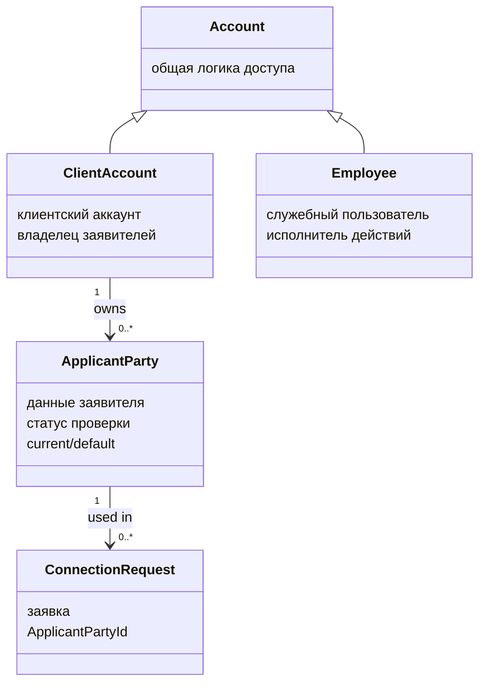

Да, вот **обновлённый полный драфт 3.2.2** уже с учётом:

* `ClientAccount` и `Employee` наследуются от общего `Account`;
* общий `Account` нужен для потенциально общей логики доступа;
* `ApplicantParty` не аккаунт, а отдельная сохраняемая сущность заявителя;
* у сотрудника нет отдельного “EmployeeParty”, потому что данные сотрудника не являются нашей доменной областью;
* current/default — это состояние для удобства клиента;
* код в основной главе — короткий листинг, полный код — в приложение;
* объяснение должно быть простым и привязанным к проекту.

---

# Topic-драфт 3.2.2

## Реализация участников процесса: аккаунт, заявитель и сотрудник

**Статус:** draft v2.
**Место:** раздел 3.2 “Реализация модели предметной области”.
**Единая идея:** в модели разделены доступ к системе, данные стороны заявки и служебные действия сотрудника. `Account` описывает общую account-основу, `ClientAccount` и `Employee` являются пользователями системы, а `ApplicantParty` является отдельной сохраняемой сущностью заявителя.

---

## 0. Желаемый результат пункта

После пункта читатель должен понять:

| Вопрос                                                     | Ответ                                                                                                                      |
| ---------------------------------------------------------- | -------------------------------------------------------------------------------------------------------------------------- |
| Почему есть общий `Account`?                               | Потому что у клиента и сотрудника может быть общая логика доступа: вход, активация, блокировка, ограничения попыток входа. |
| Почему `ClientAccount` и `ApplicantParty` разделены?       | Аккаунт отвечает за доступ к системе, заявитель — за данные стороны, от имени которой создаётся заявка.                    |
| Почему заявитель сохраняется отдельно?                     | Он переиспользуется, связывается с заявками, имеет статус проверки и current/default-состояние.                            |
| Почему нельзя просто хранить заявителя в аккаунте?         | В простом приложении можно, но для расширяемой системы это смешивает разные ответственности и ухудшает сопровождение.      |
| Почему у сотрудника нет отдельного “заявителя сотрудника”? | Данные сотрудника не являются предметной областью ВКР; сотрудник нужен как исполнитель служебных действий.                 |
| Что такое current/default заявитель?                       | Состояние для удобства клиента: какой заявитель выбран по умолчанию для форм.                                              |
| Нужно ли вставлять код?                                    | Да, но короткий high-level листинг в главу; полный код — в приложение.                                                     |

---

## 1. Source-pass

В домен-драфте `ClientAccount` описан как объект account/auth identity and activation marker: он связан с входом, восстановлением доступа и доступом к защищённым сценариям. Там же указано, что `ClientAccount.Email` и `ApplicantParty.Email` имеют разный смысл: первый email относится ко входу и восстановлению доступа, второй — к контактным данным заявителя. 

`ApplicantParty` описан как persisted reusable applicant/contact/template data, принадлежащая `ClientAccount`. Это означает, что заявитель — не временные поля формы и не часть интернет-аккаунта, а отдельная сохраняемая сущность, которую можно использовать при создании заявок. 

Для заявки зафиксировано, что `ConnectionRequest` создаётся из сохранённого `ApplicantParty`, хранит `ApplicantPartyId` и не хранит напрямую `ClientAccountId`. Принадлежность заявки клиенту может определяться через `ApplicantParty.ClientAccountId`, а изменение current/default заявителя не должно перепривязывать уже созданные заявки. 

Current/default и verification status являются независимыми состояниями заявителя. Заявитель может быть `Unverified` или `Verified` и при этом быть либо current/default, либо нет. 

---

## 2. Вопросы и решения

### Вопрос 1. Почему в модели есть общий `Account`?

`Account` нужен для общей части, связанной с доступом к системе. Клиент и сотрудник выполняют разные действия, но оба являются пользователями приложения: они могут входить в систему, иметь email, состояние активации, блокировку, ограничения попыток входа или другие account-механизмы.

Сейчас такая общая логика может быть минимальной. Но сама модель оставляет место для развития: если позже появится блокировка аккаунта, лимитирование попыток входа или единое состояние активации, это не придётся дублировать отдельно в клиенте и сотруднике.

Простая формулировка:

> `Account` — это общая часть для тех, кто входит в систему. `ClientAccount` и `Employee` — разные участники процесса, но оба являются аккаунтами приложения.

---

### Вопрос 2. Почему заявитель не является аккаунтом?

Потому что заявитель не входит в систему. Он не имеет своей сессии, не выполняет вход и не управляет доступом.

Заявитель отвечает на другой вопрос:

```text
ClientAccount — кто вошёл в систему?
ApplicantParty — от чьего имени создаётся заявка?
Employee — кто выполняет служебное действие?
```

Поэтому `ApplicantParty` не должен наследоваться от `Account`.

---

### Вопрос 3. Почему данные заявителя нельзя просто хранить в `ClientAccount`?

В совсем простом приложении можно было бы сделать так: добавить в `ClientAccount` поля ФИО, телефон, контактный email и использовать их при создании заявки. Но для приложения, которое должно развиваться и оставаться сопровождаемым, это плохое направление.

Если смешать аккаунт и заявителя, быстро появляются вопросы:

```text
- как хранить несколько заявителей у одного клиента?
- как отличить email для входа от контактного email заявителя?
- как подтвердить заявителя, но не “подтверждать аккаунт”?
- что делать со старыми заявками после изменения данных заявителя?
- как выбрать заявителя по умолчанию для новой заявки?
```

Поэтому в модели разделены две ответственности:

```text
ClientAccount:
  доступ к системе, сессия, владение клиентскими данными.

ApplicantParty:
  данные стороны заявки, статус проверки, current/default, связь с заявками.
```

Это связано с требованиями расширяемости и сопровождаемости. Когда разные смыслы смешиваются в одном классе, проект быстро становится сложнее изменять: каждое новое требование начинает затрагивать слишком много кода.

---

### Вопрос 4. Почему заявитель — отдельная persistable сущность?

Потому что заявитель нужен не только в момент заполнения формы. Он должен сохраняться и участвовать в дальнейших сценариях.

`ApplicantParty` нужен для того, чтобы:

```text
- хранить данные стороны заявки;
- принадлежать клиентскому аккаунту;
- переиспользоваться при создании новых заявок;
- быть связанным с уже созданными заявками;
- иметь статус проверки;
- быть current/default для удобства заполнения формы.
```

Главный пример:

> клиент создал заявку от одного заявителя, потом выбрал другого заявителя по умолчанию. Уже созданная заявка не должна “переехать” на нового заявителя. Она остаётся связанной с тем `ApplicantParty`, который использовался при создании.

---

### Вопрос 5. Что такое current/default заявитель?

Current/default — это состояние для удобства клиента.

Это не статус проверки и не “главный заявитель навсегда”. Это просто сохранённый заявитель, который подставляется в форму по умолчанию.

```text
current/default = удобство заполнения формы;
Verified/Unverified = статус проверки данных.
```

Поэтому возможны сочетания:

```text
Unverified + current/default
Verified + current/default
Unverified + not current/default
Verified + not current/default
```

---

### Вопрос 6. Почему у сотрудника нет разделения на `EmployeeAccount` и `EmployeeParty`?

Потому что эта ВКР не про управление кадровыми данными сотрудников.

Для сотрудника нам важно:

```text
- он вошёл в систему;
- у него есть служебная роль;
- он может выполнить действие;
- система фиксирует, какой сотрудник начал рассмотрение, одобрил, отклонил или отправил предложение.
```

Нам не важно в рамках этой предметной области:

```text
- кадровая карточка сотрудника;
- адрес сотрудника;
- документы сотрудника;
- история должностей;
- проверка контактных данных сотрудника;
- заявительские данные сотрудника.
```

Поэтому сотрудник в модели проще, чем клиентская сторона. Клиент разделяется на аккаунт и заявителя, потому что клиент создаёт заявки от имени заявителей. Сотрудник не подаёт заявки от своего имени, а выполняет служебные действия.

---

## 3. Визуализация

Для этого пункта лучше использовать **схему классов**, а не скриншот папок или полный код.

**Рисунок 3.x — Разделение аккаунта, заявителя и сотрудника**



Смысл схемы:

```text
ClientAccount и Employee наследуют общую account-часть.
ApplicantParty не наследует Account, потому что заявитель не входит в систему.
ConnectionRequest связывается с ApplicantParty, а не просто с аккаунтом.
```

---

## 4. Как использовать код в этом пункте

В основной главе не нужно приводить полный код всех классов. Это будет перегружать текст и дублировать репозиторий.

Лучше:

```text
в основной главе:
  короткий листинг, который показывает идею решения;

в приложении:
  полные листинги ключевых классов предметной модели.
```

Код лучше вставлять текстом, а не скриншотом:

```text
Основной текст: Times New Roman 14
Листинги кода: Courier New 10–11
```

Фраза для ВКР:

> В основном тексте приведён сокращённый фрагмент модели, демонстрирующий структуру решения. Полные листинги ключевых классов предметной модели целесообразно вынести в приложение.

---

## 5. Clean text candidate

## 3.2.2 Реализация участников процесса: аккаунт, заявитель и сотрудник

После описания роли доменного проекта необходимо рассмотреть участников процесса, с которыми работают основные сценарии приложения. В модели выделяются общий аккаунт, клиентский аккаунт, заявитель и сотрудник. Такое разделение связано не с формальным усложнением модели, а с разными областями ответственности этих объектов.

Общий `Account` используется для той части поведения, которая относится к доступу в систему и потенциально может быть общей для клиента и сотрудника. К такой логике относятся email для входа, состояние активации, блокировка аккаунта, ограничение попыток входа и другие механизмы доступа. В текущей реализации эта общая логика может быть минимальной, однако само выделение общего основания оставляет возможность развивать account-механизмы без смешивания их с данными заявителя или правилами обработки заявок.

Клиентский аккаунт представляет пользователя, который входит в web-приложение со стороны клиента. Он связан с аутентификацией, сессией и владением клиентскими данными. При этом клиентский аккаунт не должен подменять собой заявителя. Аккаунт отвечает на вопрос: кто вошёл в систему. Заявитель отвечает на другой вопрос: от чьего имени создаётся заявка.

В доменной модели это разделение имеет практический смысл. Email клиентского аккаунта используется для входа в систему и восстановления доступа. Email заявителя используется как контактный email стороны, от имени которой создаётся заявка. Эти значения могут совпадать, но по смыслу они различны. Поэтому их нельзя считать одним и тем же полем.

В очень простом приложении данные заявителя можно было бы хранить прямо внутри клиентского аккаунта. Однако для приложения, рассчитанного на развитие и сопровождение, такое решение быстро создаёт проблемы. Если смешать данные доступа и данные заявителя, становится сложно поддерживать несколько заявителей у одного клиента, отличать email для входа от контактного email заявителя, подтверждать данные заявителя отдельно от аккаунта и сохранять корректную связь уже созданных заявок с тем заявителем, который был выбран в момент подачи.

Поэтому `ApplicantParty` реализуется как отдельная сохраняемая сущность. Он принадлежит клиентскому аккаунту, содержит данные стороны заявки, имеет статус проверки и может использоваться повторно. Это не временный набор полей формы, а самостоятельный объект предметной модели, с которым дальше связаны создание заявки, проверка данных заявителя и просмотр истории заявок.

В текущей модели заявка создаётся от имени конкретного заявителя. Поэтому `ConnectionRequest` связывается с `ApplicantParty`. Такое решение сохраняет устойчивую связь заявки с данными, выбранными при её создании. Если клиент позднее выберет другого заявителя по умолчанию, уже созданная заявка не должна автоматически перепривязываться к новому заявителю.

Отдельного пояснения требует состояние current/default заявителя. Это состояние введено для удобства клиента. Оно показывает, какой сохранённый заявитель используется как вариант по умолчанию при заполнении форм. Current/default не является статусом проверки. Статус проверки заявителя выражается отдельно: заявитель может быть неподтверждённым или подтверждённым. Поэтому возможны разные сочетания: неподтверждённый заявитель может быть current/default, подтверждённый заявитель может быть current/default, а может и не быть выбранным по умолчанию.

Сотрудник имеет другую роль. В рамках данной ВКР не моделируется полноценная предметная область кадрового учёта сотрудников. Для реализуемой системы важно не хранить расширенные данные сотрудника, а определить, что сотрудник является служебным пользователем, который выполняет действия над заявками и договорными обменами.

Поэтому для сотрудника не вводится отдельная сущность, аналогичная заявителю. Сотрудник не подаёт заявки от своего имени и не имеет заявительских данных. Он участвует в сценариях как исполнитель действия: просматривает заявки, начинает рассмотрение, одобряет или отклоняет заявку, начинает договорный обмен и отправляет версию договорного предложения. В таких сценариях важно зафиксировать, какой сотрудник выполнил действие, но не требуется моделировать его данные как отдельную сторону процесса.

Такое разделение участников помогает дальше описывать функциональные сценарии. При создании заявки клиентский аккаунт определяет владельца данных, заявитель определяет сторону заявки, а сотрудник в этом сценарии не участвует. При рассмотрении заявки сотрудник становится активным исполнителем, а заявитель остаётся стороной, данные которой проверяются. При договорном обмене сотрудник и клиент могут выступать отправителями версий договорного предложения, но сам обмен связан с заявкой и её заявителем.

**Таблица 3.x — Ответственность участников процесса**

| Участник         | За что отвечает                                                                | Что не является его ответственностью                       |
| ---------------- | ------------------------------------------------------------------------------ | ---------------------------------------------------------- |
| `Account`        | общая логика доступа к системе                                                 | данные заявителя и правила подачи заявки                   |
| `ClientAccount`  | вход клиента, сессия, владение клиентскими данными                             | контактные данные заявителя в конкретной заявке            |
| `ApplicantParty` | данные заявителя, статус проверки, current/default-состояние, связь с заявками | аутентификация и восстановление доступа                    |
| `Employee`       | служебные действия: рассмотрение, одобрение, отказ, договорный обмен           | хранение клиентских данных и подача заявок от своего имени |

**Таблица 3.x — Различие клиентского аккаунта и заявителя**

| Вопрос                                 | `ClientAccount`                        | `ApplicantParty`                                        |
| -------------------------------------- | -------------------------------------- | ------------------------------------------------------- |
| Что обозначает?                        | пользователя, который входит в систему | сторону, от имени которой создаётся заявка              |
| Для чего нужен email?                  | вход, восстановление доступа, сессия   | контакт заявителя                                       |
| Может ли переиспользоваться в заявках? | напрямую нет                           | да, заявитель выбирается при создании заявки            |
| Имеет ли статус проверки заявителя?    | нет                                    | да: `Unverified` / `Verified`                           |
| Может ли быть current/default?         | нет                                    | да, как состояние для удобства клиента                  |
| Что происходит при изменении?          | меняются данные доступа или профиля    | старые заявки не должны автоматически перепривязываться |

Для наглядного представления разделения участников можно использовать схему классов.

**Рисунок 3.x — Разделение аккаунта, заявителя и сотрудника**


В основной главе целесообразно приводить не полный исходный код классов, а короткие фрагменты, которые показывают ключевое решение модели. Полные листинги классов предметной модели лучше вынести в приложение. Для данного пункта достаточно сокращённого листинга, показывающего разделение аккаунта, заявителя и заявки.

**Листинг 3.x — Сокращённая структура участников процесса**

```csharp
public abstract class Account
{
    public long Id { get; protected set; }
    public EmailAddress Email { get; protected set; }
    public AccountActivationState ActivationState { get; protected set; }
}

public sealed class ClientAccount : Account
{
    // Клиентский аккаунт используется для входа клиента
    // и владения клиентскими данными.
}

public sealed class Employee : Account
{
    // Сотрудник является служебным пользователем
    // и выполняет действия обработки заявок.
}

public abstract class ApplicantParty
{
    public long Id { get; protected set; }

    // Заявитель принадлежит клиентскому аккаунту,
    // но сам не является аккаунтом для входа.
    public long ClientAccountId { get; protected set; }

    public ApplicantPartyType Type { get; protected set; }
    public ApplicantPartyVerificationStatus VerificationStatus { get; protected set; }

    // В текущей реализации это поле может иметь техническое имя
    // IsCurrentActiveVersion, но по смыслу оно обозначает
    // current/default заявителя для удобства клиента.
    public bool IsCurrentActiveVersion { get; protected set; }
}

public sealed class ConnectionRequest
{
    public long Id { get; private set; }

    // Заявка создаётся от имени конкретного заявителя.
    public long ApplicantPartyId { get; private set; }

    public RequestStatus Status { get; private set; }
}
```

В листинге показано главное решение модели: `ClientAccount` и `Employee` относятся к аккаунтам системы, потому что оба участника могут входить в приложение и использовать общую account-логику. `ApplicantParty` не наследуется от `Account`, потому что заявитель не входит в систему самостоятельно. Он является сохраняемой бизнес-сущностью, принадлежащей клиентскому аккаунту, и используется как сторона, от имени которой создаётся заявка.

Таким образом, модель участников процесса разделяет доступ к системе, данные стороны заявки и служебные действия сотрудника. Это делает дальнейшую реализацию более обслуживаемой: account-логику можно развивать отдельно, данные заявителя — отдельно, а действия сотрудника — как часть сценариев обработки заявки и договорного обмена. Полные листинги ключевых классов предметной модели целесообразно привести в приложении, а в основной главе оставить только те фрагменты, которые объясняют принятые проектные решения.
