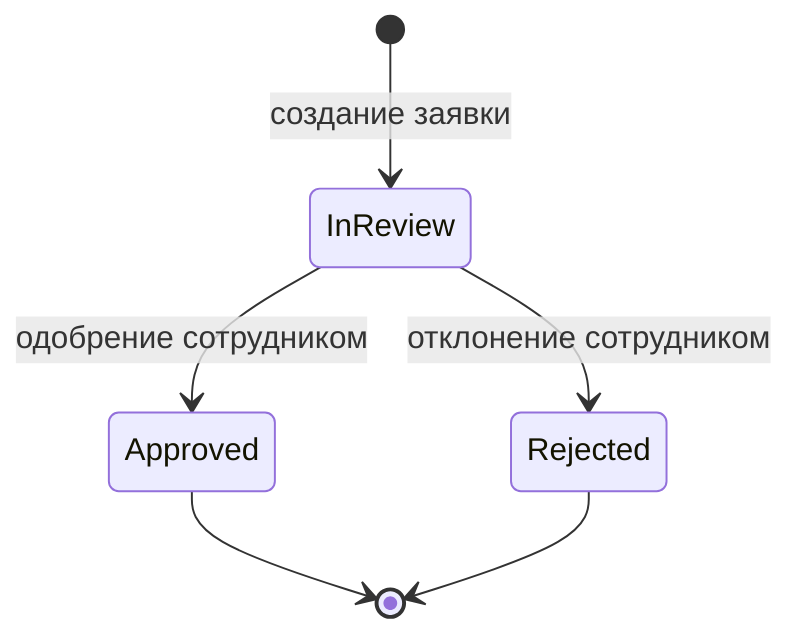

# Topic-драфт 3.2.3

## Реализация заявки и её жизненного цикла

**Статус:** draft v1 / уточнён по source-pass заметке пользователя / требует финального repo-check.
**Единая идея:** заявка является центральным объектом процесса до договорного обмена. Она создаётся от имени конкретного заявителя, хранит связь с ним и проходит ограниченный жизненный цикл: `InReview`, `Approved`, `Rejected`.

---

## 0. Source-pass rule для пункта

Для каждого пункта 3.2 используется единый порядок источников:

```text
1. Сценарная текстовая спецификация
   → что должен делать пользователь/сотрудник.

2. Behavior items / scenario data
   → какие состояния, ошибки, блокировки и данные важны.

3. Domain draft
   → какие объекты и правила отвечают за это поведение.

4. Slice draft
   → как сценарий разложен на backend/client/API/test implementation.

5. Repo/code
   → что реально реализовано и какие фрагменты можно показать.
```

---

## 1. Уточнённый текст пункта

В этом пункте рассматривается заявка как центральный объект процесса до перехода к договорному обмену. В доменной модели она описывается как `ConnectionRequest`: объект, созданный от имени конкретного заявителя и проходящий через ограниченный набор состояний.

По домен-драфту `ConnectionRequest` создаётся не просто от клиентского аккаунта, а из сохранённого `ApplicantParty`. Это важно, потому что аккаунт отвечает за доступ клиента к системе, а заявитель — за данные стороны, от имени которой подаётся заявка. Поэтому заявка хранит `ApplicantPartyId` и не хранит напрямую `ClientAccountId`; принадлежность заявки клиенту может быть определена через связь `ConnectionRequest -> ApplicantParty -> ClientAccount`.

Такое решение сохраняет смысл заявки. Если клиент имеет несколько заявителей, каждая заявка должна быть связана именно с тем заявителем, который был выбран при её создании. Если позднее клиент изменит current/default заявителя, уже созданные заявки не должны автоматически перепривязываться. Это решение отдельно зафиксировано в use-case coordination notes: request creation uses `ApplicantParty`, а изменение current/default не переписывает существующие заявки.

Заявка имеет собственный жизненный цикл. В текущем доменном направлении она создаётся в состоянии `InReview`, затем может быть одобрена или отклонена сотрудником. Для заявки зафиксированы ограничения: она должна создаваться из сохранённого заявителя, должна иметь данные заявки и адрес объекта, а одобрение и отклонение допустимы только из состояния рассмотрения.

Упрощённый жизненный цикл заявки можно показать так:



Здесь важно не смешивать два уровня. В 3.2.3 описывается высокоуровневый жизненный цикл заявки: `InReview`, `Approved`, `Rejected`. Более подробное рассмотрение действий сотрудника — начало рассмотрения, исполнитель, review-state, одобрение и отклонение — лучше раскрывать в следующем пункте 3.2.4. В слайсе `Start Request Review` прямо указано, что start review — это не approval, не rejection и не создание договорного обмена; это отдельный момент, когда сотрудник берёт заявку в активное рассмотрение.

Одобрение заявки также не создаёт договорный обмен автоматически. Это отдельное проектное решение: approval переводит заявку в состояние `Approved`, но `AgreementProposalExchange` начинается отдельным действием сотрудника. В domain draft это отмечено как правило: approval enables agreement proposal creation, но не создаёт exchange автоматически.

Также есть важная граница между доменом и application layer. Сама заявка отвечает за своё состояние: можно ли её одобрить или отклонить. Но сценарий одобрения шире, чем изменение одного объекта. В текущем направлении реализации одобрение заявки дополнительно подтверждает `ApplicantParty` через application service. Это значит, что command handler/application service загружает заявку, заявителя и сотрудника, вызывает нужные доменные операции и сохраняет изменения как единое действие.

---

## 2. Визуальные материалы

Для 3.2.3 целесообразно использовать:

1. **Диаграмма связи заявки с заявителем**  
   `ClientAccount -> ApplicantParty -> ConnectionRequest`.

2. **Диаграмма состояний заявки**  
   `InReview -> Approved / Rejected`.

3. **Скриншот кода 1**  
   Фрагмент класса `ConnectionRequest`, где видно `ApplicantPartyId`, `Status`, `Details`, `ObjectAddress`.

4. **Скриншот кода 2**  
   Фрагмент операций `Create`, `Approve`, `Reject` или их фактических аналогов.

Подписи:

```text
Рисунок 3.x — Связь заявки с заявителем
Рисунок 3.x — Жизненный цикл заявки
Рисунок 3.x — Фрагмент класса заявки
Рисунок 3.x — Операции жизненного цикла заявки
```

---

## 3. Короткий вывод

Таким образом, заявка является центральным объектом процесса до договорного обмена. Она создаётся от имени конкретного заявителя, хранит связь с ним и проходит ограниченный жизненный цикл. Это позволяет не смешивать заявку с аккаунтом клиента и не выполнять произвольные изменения статуса. Подробные действия сотрудника над заявкой рассматриваются далее как отдельный функциональный срез обработки.
