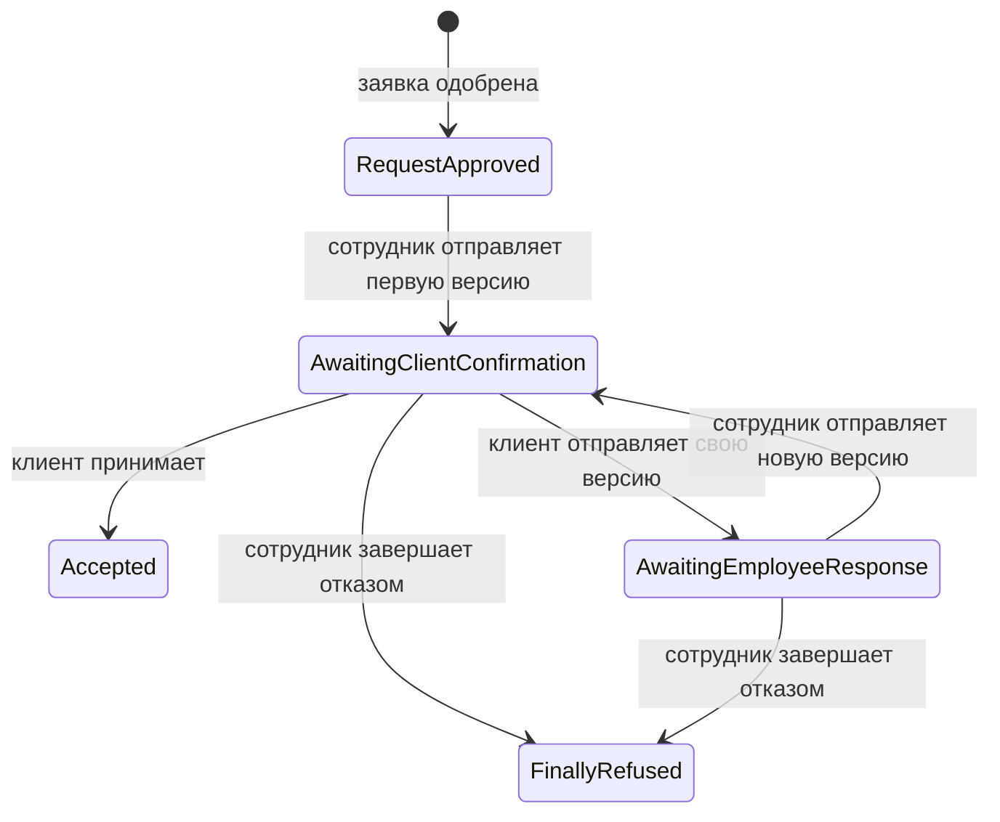
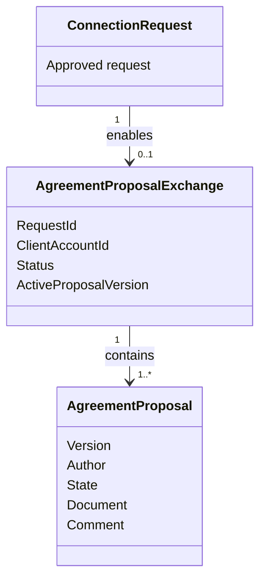

Да, обновляю **3.2.5** уже в новой логике: не просто “что такое договорный обмен”, а **какие доменные методы есть, что они делают и какие правила защищают**.

# Содержание текущего блока 3.2

```text
3.2 Реализация модели предметной области

3.2.1 Назначение доменного проекта и его место в реализации сценариев
3.2.2 Реализация участников процесса: аккаунт, заявитель и сотрудник
3.2.3 Реализация заявки и её жизненного цикла
3.2.4 Реализация рассмотрения заявки сотрудником
3.2.5 Реализация договорного обмена
3.2.6 Реализация версий договорных предложений и документов
3.2.7 Доменные ограничения, ошибки и невозможные состояния
3.2.8 Проверка правил предметной модели
```

---

# Topic-драфт 3.2.5

## Реализация договорного обмена

**Статус:** draft v2 / уточнён по сценариям, slice-докам и фактическим доменным методам.
**Единая идея:** договорный обмен — это отдельная модель после одобрения заявки. Она хранит состояние обмена, активную версию предложения, историю версий и защищает правила того, кто и когда может отправить следующую версию.

---

## 0. Желаемый результат пункта

После 3.2.5 читатель должен понять:

| Вопрос                                            | Ответ                                                                                                                         |
| ------------------------------------------------- | ----------------------------------------------------------------------------------------------------------------------------- |
| Когда начинается договорный обмен?                | После одобрения заявки, отдельным действием сотрудника.                                                                       |
| Почему approve не создаёт exchange автоматически? | Одобрение заявки и отправка договорного предложения — разные действия.                                                        |
| Кто создаёт первое предложение?                   | Сотрудник. Клиент не может начать exchange без employee-sent proposal.                                                        |
| Что хранит `AgreementProposalExchange`?           | Ссылку на заявку, клиента, статус обмена, активную версию и список предложений.                                               |
| Зачем нужна активная версия?                      | Чтобы понимать, на какое предложение сейчас ожидается ответ.                                                                  |
| Какие основные действия есть?                     | Start by employee, accept by client, client send own version, employee send new version, final refuse.                        |
| Что защищают методы?                              | Порядок обмена: клиент отвечает только на версию сотрудника, сотрудник — на версию клиента, accepted нельзя supersede/refuse. |
| Какие скрины кода нужны?                          | Сигнатуры и ключевые проверки методов `AgreementProposalExchange` и `AgreementProposal`.                                      |

---

## 1. Source-pass

Сценарий `SC-13D` описывает, что сотрудник начинает создание договорного предложения из одобренной заявки или отправляет новую employee-версию в ответ на client-sent proposal. В предусловиях указано, что связанная заявка должна иметь статус `Approved`, сотрудник должен быть авторизован, а при отправке предложения прикладывается документ и текстовый комментарий. После отправки employee proposal получает состояние ожидания подтверждения клиента. 

В `SC-13D` также зафиксированы инварианты: договорный обмен может быть начат только сотрудником, первая версия создаётся только из approved request, клиент не может начать exchange без employee-sent proposal, а версия сотрудника должна включать документ и комментарий. Если сотрудник отвечает на client-sent proposal новой версией, предыдущая клиентская версия становится superseded/replaced, а не обычным rejected. 

Сценарий `SC-13A` описывает клиентский список договорных предложений: клиент видит только собственные предложения, отправителя, статус и может открыть детали. Предложение должно быть связано с approved request, доступной этому клиенту. 

Сценарий `SC-13B` описывает детали договорного предложения: клиент видит связанную approved request, отправителя, статус, комментарий, документ и доступные действия. Если employee-sent proposal ожидает подтверждения, клиент может принять его или отправить одну собственную версию с документом и комментарием. 

Slice `SL-AGR-EXCH-001` уточняет старт exchange: команда сотрудника загружает approved `ConnectionRequest`, принимает `documentRef` и `comment`, создаёт `AgreementProposalExchange`, создаёт первую employee proposal version, устанавливает active version = 1, статус `AwaitingClientConfirmation` и возвращает `204 No Content`. Там же отдельно указано, что approve review не создаёт exchange автоматически. 

Фактический доменный класс `AgreementProposalExchange` содержит `RequestId`, `ClientAccountId`, `Status`, `ActiveProposalVersion`, коллекцию `Proposals`, а также поля финального отказа. В нём реализованы методы `StartByEmployee`, `ClientAcceptActiveProposal`, `ClientSendOwnVersion`, `EmployeeSendNewVersion` и `FinalRefuseProposal`. 

Класс `AgreementProposal` содержит версию, автора, состояние, документ, комментарий и дату создания. В нём есть фабрики `EmployeeProposal` и `ClientProposal`, а также операции `MarkAccepted` и `MarkSupersededByCounterProposal`. 

---

## 2. Вопросы и решения

### Вопрос 1. Почему договорный обмен — отдельная модель, а не часть заявки?

Потому что заявка и договорный обмен отвечают за разные этапы.

```text
Заявка:
  создаётся от имени заявителя;
  проходит рассмотрение;
  получает Approved или Rejected.

Договорный обмен:
  начинается после Approved;
  хранит версии предложений;
  знает активную версию;
  фиксирует отправителя каждой версии;
  позволяет принять предложение или отправить встречную версию.
```

Если всё хранить в заявке, заявка станет объектом “обо всём”: рассмотрение, документы, версии, ответы клиента, встречные предложения сотрудника, финальный отказ. Поэтому exchange выделяется отдельно.

---

### Вопрос 2. Почему approve не создаёт exchange автоматически?

Потому что это разные действия сотрудника.

```text
ApproveReview:
  сотрудник завершает рассмотрение заявки положительно.

StartAgreementExchange:
  сотрудник подготавливает и отправляет первую версию договорного предложения.
```

Между этими действиями может быть пауза. Состояние “заявка одобрена, но договорный обмен ещё не начат” является нормальным. Поэтому approve только открывает возможность следующего этапа, а exchange начинается отдельной командой.

---

### Вопрос 3. Почему первое предложение отправляет сотрудник?

Потому что договорный обмен начинается с предложения организации. Клиент не может отправить ответ на предложение, которого ещё нет.

Правильная последовательность:

```text
Request.Approved
    ↓
Employee sends first proposal
    ↓
Exchange.AwaitingClientConfirmation
    ↓
Client accepts or sends own version
```

Это защищается методом `StartByEmployee(...)`: он требует approved request, документ, сотрудника и проверяет возможность сотрудника начать договорный обмен. 

---

### Вопрос 4. Зачем нужна `ActiveProposalVersion`?

Потому что в exchange может быть несколько версий.

```text
Version 1 — employee sent
Version 2 — client sent own version
Version 3 — employee sent new version
```

Система должна знать, какая версия сейчас активна и на какую версию ожидается ответ. Поэтому exchange хранит не только список предложений, но и `ActiveProposalVersion`.

---

### Вопрос 5. Почему superseded — не rejected?

Потому что “явный отказ” и “замена встречным предложением” — разные смыслы.

```text
Rejected / final refusal:
  участник явно отказывается от продолжения или предложения.

SupersededByCounterProposal:
  версия больше не активна, потому что появилась новая встречная версия.
```

В коде это выражено отдельным состоянием `SupersededByCounterProposal` и методом `MarkSupersededByCounterProposal()`, который не даёт supersede уже принятое предложение. 

---

## 3. Таблица методов и правил

**Таблица 3.x — Методы `AgreementProposalExchange` и защищаемые правила**

| Метод                             | Что делает                                                       | Какое правило защищает                                                                                 |
| --------------------------------- | ---------------------------------------------------------------- | ------------------------------------------------------------------------------------------------------ |
| `StartByEmployee(...)`            | создаёт exchange из одобренной заявки и первой версии сотрудника | exchange начинается только сотрудником и только из `Approved` request                                  |
| `ClientAcceptActiveProposal(...)` | клиент принимает активное employee-предложение                   | принять можно только предложение, ожидающее подтверждения клиента                                      |
| `ClientSendOwnVersion(...)`       | клиент отправляет свою версию                                    | клиент отвечает только на активное employee proposal и только в `AwaitingClientConfirmation`           |
| `EmployeeSendNewVersion(...)`     | сотрудник отправляет новую версию в ответ клиенту                | сотрудник отвечает только на client proposal и только в `AwaitingEmployeeResponse`                     |
| `FinalRefuseProposal(...)`        | сотрудник окончательно прекращает обмен                          | нельзя отказаться от уже accepted/finally refused exchange; отказ возможен только в рабочих состояниях |
| `GetNextVersion()`                | вычисляет следующую версию                                       | версии идут последовательно                                                                            |
| `GetActiveProposal()`             | находит активное предложение                                     | действия выполняются над текущей активной версией                                                      |

**Таблица 3.x — Методы `AgreementProposal` и защищаемые правила**

| Метод                               | Что делает                                        | Какое правило защищает                                                                |
| ----------------------------------- | ------------------------------------------------- | ------------------------------------------------------------------------------------- |
| `EmployeeProposal(...)`             | создаёт предложение от сотрудника                 | employee proposal получает состояние `AwaitingClientConfirmation`                     |
| `ClientProposal(...)`               | создаёт предложение от клиента                    | client proposal получает состояние `SentByClient`                                     |
| `MarkAccepted()`                    | помечает предложение принятым                     | принять можно только employee proposal в состоянии ожидания клиента                   |
| `MarkSupersededByCounterProposal()` | помечает версию заменённой встречным предложением | accepted proposal нельзя supersede; уже superseded proposal нельзя supersede повторно |

---

## 4. Визуализация

### Рисунок 3.x — Жизненный цикл договорного обмена



### Рисунок 3.x — Связь exchange и версий предложений



---

## 5. Скриншоты кода для 3.2.5

Здесь лучше делать **скриншоты сигнатур и ключевых проверок**, а не весь класс.

| Скрин | Что сфотографировать                                                                                             | Подпись                                                   |
| ----- | ---------------------------------------------------------------------------------------------------------------- | --------------------------------------------------------- |
| 1     | поля `AgreementProposalExchange`: `RequestId`, `ClientAccountId`, `Status`, `ActiveProposalVersion`, `Proposals` | **Рисунок 3.x — Основные поля договорного обмена**        |
| 2     | метод `StartByEmployee(...)` вместе с проверками `Approved request`, `document`, `employee`                      | **Рисунок 3.x — Создание договорного обмена сотрудником** |
| 3     | сигнатуры и проверки `ClientAcceptActiveProposal(...)`, `ClientSendOwnVersion(...)`                              | **Рисунок 3.x — Действия клиента в договорном обмене**    |
| 4     | сигнатуры и проверки `EmployeeSendNewVersion(...)`, `FinalRefuseProposal(...)`                                   | **Рисунок 3.x — Действия сотрудника после начала обмена** |
| 5     | `AgreementProposal.EmployeeProposal`, `ClientProposal`, `MarkAccepted`, `MarkSupersededByCounterProposal`        | **Рисунок 3.x — Версия договорного предложения**          |

В основной текст можно вставить 2–3 самых важных скрина, остальные — в приложение. Для 3.2.5 я бы оставил в главе:

```text
1. Поля AgreementProposalExchange.
2. StartByEmployee.
3. ClientSendOwnVersion / EmployeeSendNewVersion или AgreementProposal methods.
```

---

# Clean text candidate

## 3.2.5 Реализация договорного обмена

После одобрения заявки процесс может перейти к договорному обмену между сотрудником и клиентом. В модели предметной области этот этап выделен в отдельный объект `AgreementProposalExchange`. Такое выделение необходимо потому, что договорный обмен имеет собственное состояние, активную версию предложения и историю версий.

Договорный обмен не создаётся автоматически при одобрении заявки. Одобрение означает, что заявка прошла рассмотрение и может перейти к следующему этапу. Однако отправка договорного предложения требует отдельного действия сотрудника: нужно подготовить документ, добавить комментарий и отправить предложение клиенту. Поэтому между одобрением заявки и началом договорного обмена может существовать нормальное промежуточное состояние: заявка уже одобрена, но exchange ещё не создан.

Начало договорного обмена выполняет сотрудник. Клиент не может начать exchange самостоятельно, потому что в текущем процессе он отвечает на предложение организации, а не создаёт первое предложение без employee-sent версии. При старте exchange создаётся не пустая сущность, а сразу первая версия договорного предложения от сотрудника. Она содержит автора, документ, комментарий, дату создания и номер версии.

В фактической реализации за старт обмена отвечает метод `StartByEmployee(...)`. Он принимает одобренную заявку, ссылку на документ, комментарий, сотрудника и время создания. Внутри метода проверяется, что заявка существует и имеет статус `Approved`, что документ передан, что сотрудник корректен и может начать договорный обмен. После этого создаётся `AgreementProposalExchange`, устанавливается статус `AwaitingClientConfirmation`, активная версия становится первой, а в коллекцию предложений добавляется employee proposal.

Такой метод защищает сразу несколько правил. Во-первых, exchange нельзя начать от несуществующей или неодобренной заявки. Во-вторых, первая версия не может быть создана без документа. В-третьих, старт exchange выполняется сотрудником, а не клиентом. Благодаря этому договорный обмен не возникает случайно как побочный эффект одобрения заявки.

Договорный обмен хранит активную версию предложения. Это важно, потому что в процессе может появиться несколько версий: первая версия от сотрудника, ответная версия от клиента, затем новая версия от сотрудника. Активная версия показывает, на какое предложение сейчас ожидается ответ. История версий при этом сохраняется в коллекции предложений.

Клиент может действовать только после того, как сотрудник отправил предложение и exchange находится в состоянии `AwaitingClientConfirmation`. В этом состоянии клиент может принять активное предложение или отправить свою версию. Принятие выполняется методом `ClientAcceptActiveProposal(...)`: он проверяет, что клиент имеет право действовать в данном exchange, что exchange действительно ожидает подтверждения клиента, затем активное предложение помечается принятым, а статус exchange становится `Accepted`.

Если клиент не принимает предложение, он может отправить собственную версию. Для этого используется метод `ClientSendOwnVersion(...)`. Он проверяет, что exchange находится в состоянии `AwaitingClientConfirmation`, что документ передан, что клиент имеет право действовать в этом exchange, а активное предложение действительно было отправлено сотрудником. После этого активное employee proposal помечается как `SupersededByCounterProposal`, создаётся новая client proposal, активная версия обновляется, а exchange переходит в состояние `AwaitingEmployeeResponse`.

Сотрудник может ответить на клиентскую версию новой версией предложения. Для этого используется метод `EmployeeSendNewVersion(...)`. Он допускается только в состоянии `AwaitingEmployeeResponse`. Метод проверяет документ, сотрудника, возможность сотрудника отправить предложение и то, что активное предложение было отправлено клиентом. После этого клиентская версия помечается как superseded, создаётся новая employee proposal, активная версия обновляется, а exchange снова переходит в `AwaitingClientConfirmation`.

Отдельно реализован финальный отказ от продолжения договорного обмена. Метод `FinalRefuseProposal(...)` используется сотрудником и переводит exchange в состояние `FinallyRefused`. При этом нельзя выполнить финальный отказ, если exchange уже принят или уже находится в состоянии final refusal. Это защищает модель от противоречивых состояний: принятый договорный обмен нельзя задним числом прекратить отказом.

Версия договорного предложения представлена отдельным объектом `AgreementProposal`. Она хранит номер версии, автора, состояние, документ, комментарий и дату создания. Для создания версий используются фабричные методы `EmployeeProposal(...)` и `ClientProposal(...)`. Они различаются не только автором, но и начальным состоянием: employee proposal ожидает подтверждения клиента, а client proposal фиксируется как отправленное клиентом предложение.

Методы `MarkAccepted()` и `MarkSupersededByCounterProposal()` отвечают за изменение состояния отдельной версии. `MarkAccepted()` разрешает принять только employee proposal в состоянии ожидания подтверждения клиента. `MarkSupersededByCounterProposal()` помечает версию как заменённую встречным предложением и не позволяет заменить уже принятое или уже заменённое предложение. Это важно, потому что superseded не является обычным rejected: версия не отклонена окончательно, а перестала быть активной из-за появления новой встречной версии.

Жизненный цикл договорного обмена представлен на рисунке 3.x.


Связь exchange и версий предложений представлена на рисунке 3.x.


**Таблица 3.x — Основные состояния договорного обмена**

| Состояние                    | Значение                                       | Как возникает                                              |
| ---------------------------- | ---------------------------------------------- | ---------------------------------------------------------- |
| `AwaitingClientConfirmation` | ожидается решение клиента по employee proposal | после первой версии сотрудника или новой версии сотрудника |
| `AwaitingEmployeeResponse`   | ожидается ответ сотрудника на client proposal  | после отправки клиентской версии                           |
| `Accepted`                   | клиент принял активное предложение             | после `ClientAcceptActiveProposal(...)`                    |
| `FinallyRefused`             | сотрудник окончательно прекратил обмен         | после `FinalRefuseProposal(...)`                           |

**Таблица 3.x — Методы договорного обмена и их назначение**

| Метод                             | Назначение                                        | Защищаемое правило                                             |
| --------------------------------- | ------------------------------------------------- | -------------------------------------------------------------- |
| `StartByEmployee(...)`            | начать exchange и создать первую employee version | только approved request, только сотрудник, документ обязателен |
| `ClientAcceptActiveProposal(...)` | принять активное предложение                      | клиент принимает только employee proposal в нужном состоянии   |
| `ClientSendOwnVersion(...)`       | отправить клиентскую версию                       | клиент отвечает только на active employee proposal             |
| `EmployeeSendNewVersion(...)`     | отправить новую employee version                  | сотрудник отвечает только на active client proposal            |
| `FinalRefuseProposal(...)`        | окончательно прекратить exchange                  | нельзя final refuse accepted или already refused exchange      |

Для подтверждения реализации в основной текст следует включить скриншоты фрагментов кода. В первую очередь стоит показать поля `AgreementProposalExchange`, метод `StartByEmployee(...)` и один фрагмент с действиями клиента или сотрудника над активной версией. Полные классы договорного обмена и версии предложения лучше вынести в приложение.

Таким образом, договорный обмен выделен в отдельную модель, потому что он имеет собственный жизненный цикл и историю версий. Он начинается только после одобрения заявки, но не автоматически: сотрудник явно отправляет первую версию договорного предложения. Далее клиент может принять предложение или отправить свою версию, а сотрудник может ответить новой версией или окончательно прекратить обмен. Методы `AgreementProposalExchange` и `AgreementProposal` фиксируют эти переходы и не позволяют смешивать разные состояния процесса.
