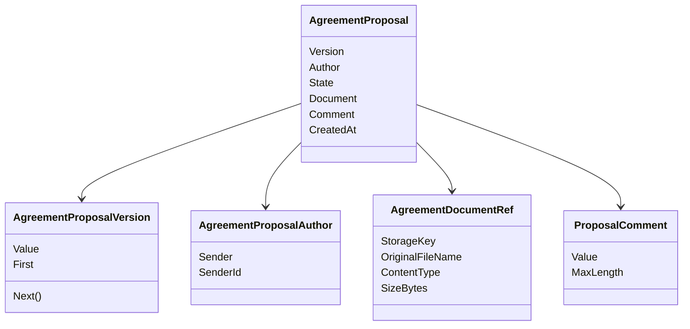

Да, следующий пункт — **3.2.6 Реализация версий договорных предложений и документов**.

Здесь лучше не повторять весь exchange из 3.2.5, а сфокусироваться на том, **из чего состоит одна версия предложения**:

```text
AgreementProposal
AgreementProposalVersion
AgreementProposalAuthor
AgreementDocumentRef
ProposalComment
```

# Содержание текущего блока 3.2

```text
3.2 Реализация модели предметной области

3.2.1 Назначение доменного проекта и его место в реализации сценариев
3.2.2 Реализация участников процесса: аккаунт, заявитель и сотрудник
3.2.3 Реализация заявки и её жизненного цикла
3.2.4 Реализация рассмотрения заявки сотрудником
3.2.5 Реализация договорного обмена
3.2.6 Реализация версий договорных предложений и документов
3.2.7 Доменные ограничения, ошибки и невозможные состояния
3.2.8 Проверка правил предметной модели
```

---

# Topic-драфт 3.2.6

## Реализация версий договорных предложений и документов

**Единая идея:** договорный обмен хранит не один “файл договора”, а последовательность версий предложений. Каждая версия знает номер, отправителя, состояние, документ и комментарий. Сам файл хранится технически вне домена, а в доменной модели фиксируется ссылка на документ и его значимые метаданные.

---

## 0. Желаемый результат пункта

После 3.2.6 читатель должен понять:

| Вопрос                                               | Ответ                                                                                                         |
| ---------------------------------------------------- | ------------------------------------------------------------------------------------------------------------- |
| Что такое версия договорного предложения?            | Отдельное предложение внутри exchange: кто отправил, какой документ приложен, какой номер версии и состояние. |
| Почему нельзя хранить просто один файл договора?     | В процессе возможны встречные версии клиента и сотрудника, поэтому нужна история.                             |
| Что хранит `AgreementProposal`?                      | Версию, автора, состояние, ссылку на документ, комментарий и дату создания.                                   |
| Что хранит `AgreementProposalVersion`?               | Положительный номер версии и операцию получения следующей версии.                                             |
| Что хранит `AgreementProposalAuthor`?                | Тип отправителя: сотрудник или клиент, и идентификатор отправителя.                                           |
| Что хранит `AgreementDocumentRef`?                   | Не сам файл, а ссылку на файл и метаданные: ключ хранения, имя файла, content type, размер.                   |
| Почему документ не хранится прямо в доменной модели? | Домену важен факт и смысл документа в процессе, а физическое хранение относится к инфраструктуре.             |
| Какие скрины кода нужны?                             | Сигнатуры `AgreementProposal`, `AgreementProposalVersion`, `AgreementDocumentRef`, `AgreementProposalAuthor`. |

---

## 1. Source-pass

Сценарий `SC-13D` указывает, что employee proposal должен содержать attached agreement document/version и text details/comment. После отправки предложение получает состояние `AwaitingClientConfirmation` и становится видимым клиенту и сотруднику. 

Сценарий `SC-13B` описывает, что клиент в деталях договорного предложения видит связанный approved request, отправителя, статус, текстовый комментарий и attached agreement document/file. Если предложение ожидает подтверждения клиента, клиент может принять его или отправить собственную версию с документом и комментарием. 

В реализации `AgreementProposal` содержит `Version`, `Author`, `State`, `Document`, `Comment` и `CreatedAt`. Для создания предложений используются фабрики `EmployeeProposal(...)` и `ClientProposal(...)`. Employee proposal создаётся в состоянии `AwaitingClientConfirmation`, а client proposal — в состоянии `SentByClient`. 

`AgreementProposalVersion` реализован как value object с положительным целочисленным значением. У него есть `First`, `Next()`, сравнение и строковое представление. Конструктор не допускает значения меньше или равные нулю. 

`AgreementDocumentRef` хранит не бинарное содержимое файла, а ссылку и метаданные: `StorageKey`, `OriginalFileName`, `ContentType`, `SizeBytes`. Метод `Create(...)` проверяет, что ключ хранения, имя файла, content type и размер заданы корректно. 

`ProposalComment` ограничивает текст комментария: значение обязательно и не должно превышать `MaxLength = 2000`. Это показывает, что текст предложения является отдельным value object, а не произвольной строкой без проверки. 

`AgreementProposalAuthor` хранит тип отправителя и идентификатор отправителя. Он создаётся через фабрики `Employee(employee)` и `Client(client)`, что позволяет явно различать employee-sent и client-sent версии. 

---

## 2. Вопросы и решения

### Вопрос 1. Почему предложение выделено в отдельный класс `AgreementProposal`?

Потому что в exchange может быть несколько предложений, и каждое из них имеет собственные данные:

```text
номер версии;
отправитель;
состояние;
документ;
комментарий;
дата создания.
```

Если хранить только один файл в `AgreementProposalExchange`, невозможно нормально показать историю: кто отправил предыдущую версию, какая версия была заменена, какая версия активна и какое предложение принято.

---

### Вопрос 2. Почему версия — отдельный value object, а не просто `int`?

Технически номер версии можно было бы хранить как `int`. Но value object делает смысл явным:

```text
версия должна быть положительной;
первая версия = 1;
следующая версия получается через Next();
версии можно сравнивать.
```

Это уменьшает риск появления версии `0`, отрицательной версии или случайного использования числа не по смыслу.

---

### Вопрос 3. Почему автор предложения — отдельный объект?

Потому что важно не только “id отправителя”, но и **кто именно отправил версию**: сотрудник или клиент.

```text
Employee proposal:
  ждёт подтверждения клиента.

Client proposal:
  является ответной версией клиента.
```

Один и тот же числовой id без типа отправителя был бы неоднозначен. Поэтому `AgreementProposalAuthor` хранит и `Sender`, и `SenderId`.

---

### Вопрос 4. Почему документ представлен как `AgreementDocumentRef`, а не как файл?

Потому что доменная модель не должна заниматься физическим хранением файла.

Домену важно:

```text
у версии есть документ;
у документа есть ключ хранения;
известно исходное имя файла;
известен тип содержимого;
известен размер.
```

А где именно лежит файл — на диске, в облачном хранилище или другом storage — это инфраструктурная деталь. Поэтому в домене хранится ссылка и метаданные, а не бинарное содержимое.

---

### Вопрос 5. Почему комментарий выделен в `ProposalComment`?

Потому что комментарий тоже имеет правила: он не должен быть пустым и не должен быть слишком длинным. Если хранить комментарий просто как `string`, эти проверки легко забыть в одном из endpoint-ов или форм.

---

## 3. Таблица методов и правил

**Таблица 3.x — Компоненты версии договорного предложения**

| Компонент                  | Что хранит                                             | Какое правило защищает                                     |
| -------------------------- | ------------------------------------------------------ | ---------------------------------------------------------- |
| `AgreementProposal`        | версию, автора, состояние, документ, комментарий, дату | предложение всегда связано с версией, автором и документом |
| `AgreementProposalVersion` | положительный номер версии                             | версия не может быть нулевой или отрицательной             |
| `AgreementProposalAuthor`  | тип отправителя и id отправителя                       | employee proposal и client proposal различаются явно       |
| `AgreementDocumentRef`     | ссылку на файл и метаданные                            | предложение не ссылается на “неизвестный” файл             |
| `ProposalComment`          | текстовый комментарий                                  | комментарий не пустой и не длиннее 2000 символов           |

**Таблица 3.x — Методы компонентов предложения**

| Класс                      | Метод                               | Назначение                                        |
| -------------------------- | ----------------------------------- | ------------------------------------------------- |
| `AgreementProposal`        | `EmployeeProposal(...)`             | создать версию предложения от сотрудника          |
| `AgreementProposal`        | `ClientProposal(...)`               | создать версию предложения от клиента             |
| `AgreementProposal`        | `MarkAccepted()`                    | пометить employee proposal принятым               |
| `AgreementProposal`        | `MarkSupersededByCounterProposal()` | пометить версию заменённой встречным предложением |
| `AgreementProposalVersion` | `First`                             | получить первую версию                            |
| `AgreementProposalVersion` | `Next()`                            | получить следующую версию                         |
| `AgreementDocumentRef`     | `Create(...)`                       | создать ссылку на документ с проверкой метаданных |
| `ProposalComment`          | `Create(...)`                       | создать комментарий с проверкой длины и непустоты |
| `AgreementProposalAuthor`  | `Employee(...)`                     | создать автора-сотрудника                         |
| `AgreementProposalAuthor`  | `Client(...)`                       | создать автора-клиента                            |

---

## 4. Визуализация

### Рисунок 3.x — Состав версии договорного предложения



---

## 5. Скриншоты кода для 3.2.6

Здесь можно сделать **3 скрина кода**:

| Скрин | Что сфотографировать                                                                                         | Подпись                                                        |
| ----- | ------------------------------------------------------------------------------------------------------------ | -------------------------------------------------------------- |
| 1     | поля и фабрики `AgreementProposal`: `EmployeeProposal`, `ClientProposal`                                     | **Рисунок 3.x — Структура версии договорного предложения**     |
| 2     | `AgreementDocumentRef.Create(...)` с проверками `StorageKey`, `OriginalFileName`, `ContentType`, `SizeBytes` | **Рисунок 3.x — Ссылка на документ договорного предложения**   |
| 3     | `AgreementProposalVersion` и `AgreementProposalAuthor`                                                       | **Рисунок 3.x — Номер версии и автор договорного предложения** |

В основной текст можно вставить 2 скрина, а третий оставить для приложения. Самые полезные для главы: `AgreementProposal` и `AgreementDocumentRef`.

---

# Clean text candidate

## 3.2.6 Реализация версий договорных предложений и документов

В предыдущем пункте был рассмотрен договорный обмен как общий процесс. Однако сам обмен состоит не только из состояния `AgreementProposalExchange`. Основной смысл обмена раскрывается через версии договорных предложений. Каждая версия фиксирует, кто отправил предложение, какой документ был приложен, какой комментарий был указан, какое состояние имеет предложение и в какой последовательности оно появилось.

В модели предметной области версия предложения представлена классом `AgreementProposal`. Он хранит номер версии, автора, состояние, ссылку на документ, комментарий и дату создания. Такая структура нужна потому, что в договорном обмене может быть несколько предложений: первая версия от сотрудника, ответная версия клиента и новая версия сотрудника. Если бы в системе хранился только один файл договора, невозможно было бы корректно показать историю обмена и определить, какая версия сейчас является активной.

Для создания предложений используются два фабричных метода: `EmployeeProposal(...)` и `ClientProposal(...)`. Первый создаёт предложение от сотрудника и устанавливает состояние ожидания подтверждения клиента. Второй создаёт предложение от клиента и фиксирует его как отправленную клиентскую версию. Такое разделение важно, потому что дальнейшие действия зависят от отправителя: клиент принимает только employee proposal, а сотрудник отвечает на client proposal.

Номер версии выделен в отдельный value object `AgreementProposalVersion`. Он хранит положительное целочисленное значение, предоставляет первую версию через `First` и позволяет получить следующую версию через `Next()`. Такое решение делает правило версионирования явным: версия не может быть нулевой или отрицательной, а новые версии должны идти последовательно.

Автор предложения также выделен в отдельный объект `AgreementProposalAuthor`. Он хранит тип отправителя и идентификатор отправителя. Это нужно потому, что одного числового идентификатора недостаточно: версия может быть отправлена сотрудником или клиентом. Для этого используются фабрики `Employee(employee)` и `Client(client)`, которые явно фиксируют тип отправителя.

Отдельное внимание уделено документу. В модели не хранится бинарное содержимое файла договора. Вместо этого используется `AgreementDocumentRef` — ссылка на документ и его метаданные. Она содержит ключ хранения, исходное имя файла, тип содержимого и размер файла. Метод `Create(...)` проверяет, что все эти данные заданы корректно. Это позволяет доменной модели знать, что у предложения действительно есть документ, но не привязывает её к конкретному способу хранения файла.

Такое решение разделяет предметный смысл документа и техническое хранение. Для договорного обмена важно, что версия предложения содержит документ. Но физически файл может лежать в локальном каталоге, файловом хранилище или другом storage. Эти детали относятся к инфраструктуре. Доменная модель хранит только ссылку и необходимые метаданные.

Комментарий к предложению также оформлен отдельным value object `ProposalComment`. Он ограничивает текст предложения: комментарий должен быть задан и не должен превышать максимальную длину. В текущем коде максимальная длина составляет 2000 символов. Это лучше, чем хранить комментарий как произвольную строку без проверки, потому что правило проверки оказывается рядом с самим значением.

Структура версии договорного предложения представлена на рисунке 3.x.


**Таблица 3.x — Компоненты версии договорного предложения**

| Компонент                  | Назначение                             | Защищаемое правило                                     |
| -------------------------- | -------------------------------------- | ------------------------------------------------------ |
| `AgreementProposal`        | хранит одну версию предложения         | версия всегда имеет автора, состояние, документ и дату |
| `AgreementProposalVersion` | хранит номер версии                    | версия должна быть положительной                       |
| `AgreementProposalAuthor`  | хранит отправителя версии              | сотрудник и клиент различаются явно                    |
| `AgreementDocumentRef`     | хранит ссылку на документ и метаданные | предложение должно ссылаться на корректный документ    |
| `ProposalComment`          | хранит текстовый комментарий           | комментарий не должен быть пустым или слишком длинным  |

**Таблица 3.x — Основные методы компонентов предложения**

| Класс                      | Метод                               | Что делает                                        |
| -------------------------- | ----------------------------------- | ------------------------------------------------- |
| `AgreementProposal`        | `EmployeeProposal(...)`             | создаёт версию предложения от сотрудника          |
| `AgreementProposal`        | `ClientProposal(...)`               | создаёт версию предложения от клиента             |
| `AgreementProposal`        | `MarkAccepted()`                    | помечает предложение принятым                     |
| `AgreementProposal`        | `MarkSupersededByCounterProposal()` | помечает версию заменённой встречным предложением |
| `AgreementProposalVersion` | `First`                             | возвращает первую версию                          |
| `AgreementProposalVersion` | `Next()`                            | возвращает следующую версию                       |
| `AgreementDocumentRef`     | `Create(...)`                       | создаёт ссылку на документ с проверкой метаданных |
| `ProposalComment`          | `Create(...)`                       | создаёт комментарий с проверкой длины и непустоты |
| `AgreementProposalAuthor`  | `Employee(...)`                     | создаёт автора-сотрудника                         |
| `AgreementProposalAuthor`  | `Client(...)`                       | создаёт автора-клиента                            |

Для подтверждения реализации в основной текст целесообразно включить скриншоты кода. Первый скриншот должен показать поля и фабричные методы `AgreementProposal`, потому что именно этот класс описывает одну версию предложения. Второй скриншот стоит сделать по `AgreementDocumentRef.Create(...)`, чтобы показать, что доменная модель хранит ссылку на документ и проверяет его метаданные. Дополнительно можно привести фрагмент `AgreementProposalVersion` и `AgreementProposalAuthor`, если требуется показать правила нумерации и различение отправителей.

Таким образом, версии договорных предложений реализованы не как набор файлов, а как предметные объекты обмена. Каждая версия имеет номер, автора, состояние, документ и комментарий. Документ представлен ссылкой и метаданными, а не бинарным содержимым, что отделяет доменную модель от инфраструктуры хранения. Такое решение позволяет сохранять историю согласования договора и корректно различать версии сотрудника, версии клиента, принятие предложения и замену встречным предложением.
