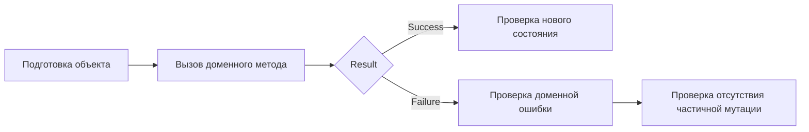

Да, следующий пункт — **3.2.8 Проверка правил предметной модели**.

Здесь важно не уходить в “все тесты проекта”. В 3.2.8 мы проверяем именно то, что описывали в 3.2:

```text
доменная модель;
состояния;
переходы;
инварианты;
Result / Failure;
отсутствие частичных изменений при ошибке.
```

А API, UI и E2E лучше раскрывать позже уже в сценарных разделах главы 3.

---

# Topic-драфт 3.2.8

## Проверка правил предметной модели

**Статус:** draft v1.
**Единая идея:** правила предметной модели проверяются отдельными доменными тестами. Эти тесты не запускают браузер и не проверяют HTTP-слой; они проверяют, что сами доменные объекты правильно меняют состояние или возвращают конкретную доменную ошибку.

---

# Содержание текущего блока 3.2

```text
3.2 Реализация модели предметной области

3.2.1 Назначение доменного проекта и его место в реализации сценариев
3.2.2 Реализация участников процесса: аккаунт, заявитель и сотрудник
3.2.3 Реализация заявки и её жизненного цикла
3.2.4 Реализация рассмотрения заявки сотрудником
3.2.5 Реализация договорного обмена
3.2.6 Реализация версий договорных предложений и документов
3.2.7 Доменные ограничения, результаты операций и невозможные состояния
3.2.8 Проверка правил предметной модели
```

---

## 0. Желаемый результат пункта

После 3.2.8 читатель должен понять:

| Вопрос                                | Ответ                                                                          |
| ------------------------------------- | ------------------------------------------------------------------------------ |
| Что проверяется в этом пункте?        | Не UI и не API, а правила доменных объектов.                                   |
| Зачем отдельные domain tests?         | Чтобы проверить бизнес-правила без браузера, HTTP и базы данных.               |
| Что считается успешной проверкой?     | Объект переходит в нужное состояние и сохраняет нужные значения.               |
| Что проверяется при ошибках?          | Операция возвращает конкретную доменную ошибку и не меняет состояние объекта.  |
| Почему проверяется конкретная ошибка? | Так видно, какое правило сработало; это полезно для отладки и маппинга ошибок. |
| Какие группы тестов важны?            | создание заявки, review, договорный обмен, документы, комментарии, версии.     |
| Где будут API/UI проверки?            | Позже в сценарных разделах, рядом с use case / slice.                          |

---

## 1. Source-pass

В тестах создания заявки проверяется, что `ConnectionRequest.Create(...)` создаёт заявку в состоянии `InReview`, сохраняет `ApplicantPartyId`, тип заявки, детали и адрес объекта, а review на момент создания отсутствует. Там же проверяются отказы: пустые детали, отсутствие адреса и попытка создать заявку от transient applicant party. 

В тестах review проверяется начало рассмотрения, запрет старта для заявки не в `InReview`, запрет повторного старта, отказ для transient request, требование started review для approve/reject, успешное approve/reject тем сотрудником, который начал review, а также failure без изменения состояния при попытке завершить review другим сотрудником. 

В тестах договорного обмена проверяется успешный `StartByEmployee(...)`: создаётся exchange, устанавливается `RequestId`, `ClientAccountId`, статус `AwaitingClientConfirmation`, активная версия `First`, создаётся единственное employee proposal с автором-сотрудником и документом. Также проверяются failure-случаи: request не approved, отсутствует документ, отсутствует сотрудник, transient request/employee. 

В тех же тестах проверяются действия клиента и сотрудника над exchange: клиент принимает active proposal, отправляет собственную версию, employee отправляет новую версию, а failure-сценарии сохраняют snapshot объекта без частичной мутации. Например, при неверном состоянии exchange, отсутствующем документе, невалидном клиенте или чужом клиенте результат должен быть failure, а состояние exchange не должно измениться. 

---

## 2. Вопросы и решения

### Вопрос 1. Почему доменные правила проверяются отдельно от API?

Потому что домен — это основа поведения.

Если проверять правило только через API или UI, тест становится тяжелее и менее точным. При падении такого теста будет не сразу понятно, что сломалось:

```text
контроллер;
аутентификация;
DTO;
валидация;
маппинг;
база данных;
сама доменная логика.
```

Доменные тесты проверяют правило напрямую:

```text
создать объект;
вызвать доменный метод;
проверить результат;
проверить состояние.
```

Так проще доказать, что инвариант защищён именно моделью.

---

### Вопрос 2. Что именно проверять в доменном тесте?

Для успешного действия:

```text
result.IsSuccess == true;
статус изменился;
связанные поля заполнены;
создана нужная версия/запись;
активная версия обновилась.
```

Для недопустимого действия:

```text
result.IsFailure == true;
result.Error содержит конкретную доменную ошибку;
статус не изменился;
связанные поля не изменились;
новые версии/записи не добавились.
```

То есть тест должен проверять не только “ошибка произошла”, но и то, что объект не был испорчен частичной мутацией.

---

### Вопрос 3. Почему важно проверять конкретную доменную ошибку?

Потому что разные ошибки означают разные нарушенные правила.

Например, failure при `ClientSendOwnVersion(...)` может означать:

```text
exchange не ждёт клиента;
документ не передан;
клиент не принадлежит exchange;
активное предложение не от сотрудника.
```

Если тест проверяет только `IsFailure`, он не показывает, какое правило сработало. Проверка конкретного кода ошибки делает тест точнее и помогает при отладке.

---

### Вопрос 4. Почему в тестах важен “без частичной мутации”?

Потому что доменный объект может изменять несколько связанных значений.

Например, при отправке клиентской версии exchange должен:

```text
пометить старую employee-версию как superseded;
создать новую client-версию;
обновить active version;
перевести exchange в AwaitingEmployeeResponse.
```

Если ошибка возникла на середине, нельзя оставить объект в состоянии “старая версия уже superseded, но новая версия не создана”. Поэтому тесты со snapshot проверяют, что при failure состояние осталось прежним.

---

# 3. Таблица проверяемых правил

**Таблица 3.x — Проверка правил предметной модели**

| Область         | Что проверяется                               | Пример ожидаемого результата                                              |
| --------------- | --------------------------------------------- | ------------------------------------------------------------------------- |
| Создание заявки | заявка создаётся от persisted applicant       | `Status = InReview`, `ApplicantPartyId` сохранён                          |
| Создание заявки | нельзя создать заявку без деталей или адреса  | failure с доменной ошибкой                                                |
| Review          | сотрудник начинает review                     | `Review.Status = Started`, сохраняется employee id                        |
| Review          | нельзя approve/reject без started review      | failure с `RequestReviewMustBeStarted`                                    |
| Review          | другой сотрудник не завершает review          | failure и состояние не меняется                                           |
| Exchange start  | exchange начинается из approved request       | `AwaitingClientConfirmation`, version 1, employee proposal                |
| Exchange start  | нельзя начать exchange не из approved request | failure с `AgreementExchangeRequiresApprovedRequest`                      |
| Client action   | клиент принимает active employee proposal     | exchange становится `Accepted`                                            |
| Client action   | клиент отправляет свою версию                 | старая версия superseded, новая версия client, exchange ждёт сотрудника   |
| Employee action | сотрудник отправляет новую версию             | client proposal superseded, новая employee version, exchange ждёт клиента |
| Failure safety  | failure не оставляет частичных изменений      | snapshot объекта не меняется                                              |

---

# 4. Таблица “поведение — тест”

**Таблица 3.x — Связь поведения модели с тестами**

| Поведение модели                             | Где проверяется                  | Что подтверждает тест                                    |
| -------------------------------------------- | -------------------------------- | -------------------------------------------------------- |
| Заявка создаётся в состоянии `InReview`      | `ConnectionRequestCreationTests` | создание заявки задаёт начальное состояние               |
| Заявка требует persisted applicant           | `ConnectionRequestCreationTests` | заявка не создаётся от несохранённого заявителя          |
| Review стартует сотрудником                  | `ConnectionRequestL2ReviewTests` | review хранит started employee и started time            |
| Approve/reject требует started review        | `ConnectionRequestL2ReviewTests` | решение нельзя принять без начала рассмотрения           |
| Завершает review тот же сотрудник            | `ConnectionRequestL2ReviewTests` | другой сотрудник получает failure без мутации            |
| Exchange создаётся с первой employee version | `AgreementProposalExchangeTests` | start exchange создаёт status, active version и proposal |
| Client version supersedes employee proposal  | `AgreementProposalExchangeTests` | встречная версия клиента корректно меняет active version |
| Employee version supersedes client proposal  | `AgreementProposalExchangeTests` | сотрудник может ответить новой версией                   |
| Failure не меняет exchange                   | `AgreementProposalExchangeTests` | объект остаётся консистентным при ошибке                 |

---

# 5. Визуализация для 3.2.8

Здесь можно сделать схему проверки.

**Рисунок 3.x — Логика доменного теста**



---

# 6. Скриншоты кода для 3.2.8

Здесь лучше сделать **2–3 скрина тестов**, не все.

| Скрин | Что сфотографировать                                                                                                                                  | Подпись                                                                    |
| ----- | ----------------------------------------------------------------------------------------------------------------------------------------------------- | -------------------------------------------------------------------------- |
| 1     | `ApproveReview_by_another_employee_fails_without_mutation`                                                                                            | **Рисунок 3.x — Проверка отказа без изменения состояния review**           |
| 2     | `ClientSendOwnVersion_fails_without_partial_mutation_when_client_is_invalid` или `ClientSendOwnVersion_fails_when_client_does_not_belong_to_exchange` | **Рисунок 3.x — Проверка отсутствия частичной мутации договорного обмена** |
| 3     | `StartByEmployee_creates_exchange_with_first_employee_proposal`                                                                                       | **Рисунок 3.x — Проверка создания договорного обмена с первой версией**    |

Эти скрины сильнее, чем просто “тесты есть”, потому что они показывают именно нашу идею: success меняет состояние, failure возвращает ошибку и не ломает объект.

---

# Clean text candidate

## 3.2.8 Проверка правил предметной модели

После реализации предметной модели необходимо проверить, что её правила действительно выполняются. В данном пункте рассматриваются проверки именно доменного уровня: создание объектов, переходы состояния, ожидаемые отказы и отсутствие частичных изменений при ошибке. Проверки API, пользовательского интерфейса и сквозных сценариев рассматриваются далее в разделах, посвящённых функциональным срезам приложения.

Доменные тесты нужны для того, чтобы проверить бизнес-правила без запуска браузера, HTTP-сервера и полноценной базы данных. Такой тест создаёт объект предметной модели, вызывает его метод и проверяет результат. Если действие допустимо, тест проверяет новое состояние объекта. Если действие недопустимо, тест проверяет конкретную доменную ошибку и отсутствие нежелательных изменений состояния.

Проверка создания заявки показывает, что `ConnectionRequest.Create(...)` создаёт заявку в состоянии `InReview`, сохраняет ссылку на выбранного заявителя, тип заявки, текстовые данные и адрес объекта. Также проверяется, что заявка не создаётся без обязательных данных: деталей заявки, адреса объекта или сохранённого заявителя. Это подтверждает правило, что заявка должна иметь устойчивую связь с persisted `ApplicantParty`.

Отдельная группа тестов проверяет рассмотрение заявки сотрудником. Тесты подтверждают, что `StartReview(...)` создаёт started review для сохранённой заявки в состоянии `InReview`, сохраняет идентификатор сотрудника и время начала. Также проверяется, что review нельзя начать для заявки в неподходящем состоянии и нельзя начать повторно.

Для одобрения и отклонения заявки проверяется, что review должен быть начат. Если сотрудник пытается одобрить или отклонить заявку без started review, операция возвращает failure с доменной ошибкой `RequestReviewMustBeStarted`, а статус заявки остаётся прежним. Это показывает, что модель не допускает решения по заявке без зафиксированного начала рассмотрения.

Важный набор тестов проверяет правило исполнителя review. Если review начал один сотрудник, другой сотрудник не может завершить его одобрением или отклонением. В таких случаях операция возвращает failure с ошибкой `RequestReviewStartedByAnotherEmployee`, а состояние заявки и review не изменяется. Это подтверждает, что модель фиксирует ответственного сотрудника и не позволяет завершить рассмотрение чужим действием.

Для договорного обмена проверяется успешное создание exchange сотрудником. Тест `StartByEmployee_creates_exchange_with_first_employee_proposal` подтверждает, что по approved request создаётся exchange со статусом `AwaitingClientConfirmation`, активной первой версией и единственным предложением от сотрудника. В этом предложении сохраняются версия, автор-сотрудник, состояние ожидания клиента и документ.

Также проверяются отрицательные сценарии старта exchange. Если request не находится в состоянии `Approved`, если документ отсутствует или если сотрудник не передан, метод возвращает failure с соответствующей доменной ошибкой. Это подтверждает, что договорный обмен не может появиться раньше одобрения заявки и не создаётся без первой версии документа.

Отдельно проверяются действия клиента в договорном обмене. Клиент может принять активное employee proposal, после чего exchange переходит в состояние `Accepted`, а предложение становится принятым. Клиент также может отправить собственную версию: при успешном выполнении исходная employee-версия помечается как `SupersededByCounterProposal`, создаётся новая client version, активная версия становится второй, а exchange переходит в состояние `AwaitingEmployeeResponse`.

Для действий сотрудника проверяется отправка новой employee version в ответ на client proposal. При успешном выполнении client proposal помечается как superseded, создаётся новая employee version, активная версия обновляется, а exchange снова переходит в состояние `AwaitingClientConfirmation`. Это подтверждает очередность договорного обмена: клиент отвечает на предложение сотрудника, сотрудник отвечает на предложение клиента.

Особенно важно, что тесты проверяют не только факт ошибки, но и отсутствие частичной мутации. Например, если клиент пытается отправить свою версию в неподходящем состоянии exchange или действует в чужом exchange, операция возвращает failure, а snapshot объекта остаётся прежним. Это защищает модель от ситуации, когда часть полей уже изменилась, но операция в целом завершилась ошибкой.

**Таблица 3.x — Проверка правил предметной модели**

| Область         | Что проверяется                               | Пример ожидаемого результата                                              |
| --------------- | --------------------------------------------- | ------------------------------------------------------------------------- |
| Создание заявки | заявка создаётся от persisted applicant       | `Status = InReview`, `ApplicantPartyId` сохранён                          |
| Создание заявки | нельзя создать заявку без деталей или адреса  | failure с доменной ошибкой                                                |
| Review          | сотрудник начинает review                     | `Review.Status = Started`, сохраняется employee id                        |
| Review          | нельзя approve/reject без started review      | failure с `RequestReviewMustBeStarted`                                    |
| Review          | другой сотрудник не завершает review          | failure и состояние не меняется                                           |
| Exchange start  | exchange начинается из approved request       | `AwaitingClientConfirmation`, version 1, employee proposal                |
| Exchange start  | нельзя начать exchange не из approved request | failure с `AgreementExchangeRequiresApprovedRequest`                      |
| Client action   | клиент принимает active employee proposal     | exchange становится `Accepted`                                            |
| Client action   | клиент отправляет свою версию                 | старая версия superseded, новая версия client, exchange ждёт сотрудника   |
| Employee action | сотрудник отправляет новую версию             | client proposal superseded, новая employee version, exchange ждёт клиента |
| Failure safety  | failure не оставляет частичных изменений      | snapshot объекта не меняется                                              |

**Таблица 3.x — Связь поведения модели с тестами**

| Поведение модели                             | Где проверяется                  | Что подтверждает тест                                    |
| -------------------------------------------- | -------------------------------- | -------------------------------------------------------- |
| Заявка создаётся в состоянии `InReview`      | `ConnectionRequestCreationTests` | создание заявки задаёт начальное состояние               |
| Заявка требует persisted applicant           | `ConnectionRequestCreationTests` | заявка не создаётся от несохранённого заявителя          |
| Review стартует сотрудником                  | `ConnectionRequestL2ReviewTests` | review хранит started employee и started time            |
| Approve/reject требует started review        | `ConnectionRequestL2ReviewTests` | решение нельзя принять без начала рассмотрения           |
| Завершает review тот же сотрудник            | `ConnectionRequestL2ReviewTests` | другой сотрудник получает failure без мутации            |
| Exchange создаётся с первой employee version | `AgreementProposalExchangeTests` | start exchange создаёт status, active version и proposal |
| Client version supersedes employee proposal  | `AgreementProposalExchangeTests` | встречная версия клиента корректно меняет active version |
| Employee version supersedes client proposal  | `AgreementProposalExchangeTests` | сотрудник может ответить новой версией                   |
| Failure не меняет exchange                   | `AgreementProposalExchangeTests` | объект остаётся консистентным при ошибке                 |

Логика доменного теста представлена на рисунке 3.x.


Для подтверждения реализации в основной текст целесообразно включить скриншоты нескольких тестов. Наиболее полезны фрагменты, где проверяется отказ без изменения состояния: например, завершение review другим сотрудником или отправка клиентской версии в неверном состоянии exchange. Также можно показать тест успешного создания договорного обмена с первой employee version. Полный набор тестов лучше не вставлять в основной текст, чтобы не перегружать главу.

Таким образом, доменные тесты подтверждают ключевую идею раздела 3.2: предметная модель не только хранит данные, но и защищает правила процесса. Успешные операции переводят объекты в ожидаемые состояния, а недопустимые операции возвращают конкретные доменные ошибки и не оставляют частичных изменений. Это создаёт основу для дальнейшего описания серверных, клиентских и интеграционных сценариев главы 3.
