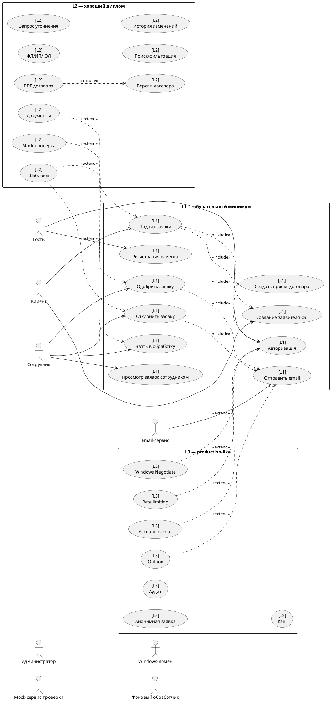

# Use Cases

## Обозначения

| Обозначение | Значение |
|---|---|
| L1 | обязательный первый слой, минимально полноценное приложение |
| L2 | расширенный слой для хорошего диплома |
| L3 | production-like слой / перспектива |

## Акторы

| Актор | Слой | Описание |
|---|---:|---|
| Гость | L1 | Неавторизованный пользователь |
| Клиент | L1 | Авторизованный пользователь, подающий заявки |
| Сотрудник | L1 | Работник компании, обрабатывающий заявки |
| Администратор | L2/L3 | Управляет настройками, справочниками, шаблонами |
| Email-сервис | L1 | Отправка email-уведомлений |
| Mock-сервис проверки | L2 | Имитация межведомственной проверки |
| Windows-домен | L3 | Windows-аутентификация сотрудников |
| Фоновый обработчик | L3 | Outbox/retry уведомлений |

## L1 use cases

### UC-L1-01. Регистрация клиента

| Поле | Описание |
|---|---|
| Актор | Гость |
| Действие | Зарегистрировать клиентский аккаунт |
| Цель | Создать учетную запись для подачи заявок |
| Предусловие | Пользователь не авторизован |
| Include | Нет |
| Extend | UC-L2-10 Подтверждение email |

Алгоритм:

1. Гость открывает страницу регистрации.
2. Вводит email, пароль, подтверждение пароля, ФИО и телефон.
3. Клиентская часть выполняет первичную валидацию.
4. Сервер проверяет данные и уникальность email.
5. Сервер создает `ClientAccount`.
6. Сервер создает базовый профиль/данные.
7. Система сообщает об успешной регистрации.

Постусловие: создан клиентский аккаунт.

### UC-L1-02. Авторизация пользователя

| Поле | Описание |
|---|---|
| Актор | Гость / Клиент / Сотрудник |
| Действие | Войти в систему |
| Цель | Получить доступ согласно роли |
| Предусловие | Аккаунт существует |
| Include | Нет |
| Extend | UC-L3-03 Rate limiting, UC-L3-04 Account lockout |

Алгоритм:

1. Пользователь вводит email и пароль.
2. Система проверяет учетные данные.
3. Система определяет роль.
4. Клиент перенаправляется в личный кабинет.
5. Сотрудник перенаправляется в рабочее место обработки заявок.

Постусловие: пользователь авторизован.

### UC-L1-03. Просмотр профиля

| Поле | Описание |
|---|---|
| Актор | Клиент |
| Действие | Просмотреть базовый профиль |
| Предусловие | Клиент авторизован |
| Include | UC-L1-02 |
| Extend | UC-L2-01 Расширенный профиль заявителя |

### UC-L1-04. Создание заявителя ФЛ

| Поле | Описание |
|---|---|
| Актор | Клиент |
| Действие | Создать `IndividualApplicantParty` |
| Цель | Указать, от чьего имени подается заявка |
| Предусловие | Клиент авторизован |
| Include | UC-L1-02 |
| Extend | UC-L2-01 |

Алгоритм:

1. Клиент открывает профиль или форму первой заявки.
2. Вводит ФИО, email, телефон.
3. Система создает `IndividualApplicantParty`.
4. Заявитель связывается с `ClientAccount`.

Постусловие: у клиента есть заявитель типа ФЛ.

### UC-L1-05. Подача заявки

| Поле | Описание |
|---|---|
| Актор | Клиент |
| Действие | Создать заявку |
| Цель | Передать обращение в ООО «ЗСК» |
| Предусловие | Клиент авторизован, создан `ApplicantParty` |
| Include | UC-L1-02, UC-L1-04 |
| Extend | UC-L2-02 Загрузка документов |

Алгоритм:

1. Клиент открывает форму подачи заявки.
2. Выбирает тип: `Connection` или `MeteringDevice`.
3. Выбирает заявителя.
4. Указывает адрес объекта.
5. Вводит текст обращения.
6. Система валидирует данные.
7. Система создает `ClientRequest`.
8. Заявка получает статус `Submitted`.

Постусловие: создана заявка со статусом `Submitted`.

### UC-L1-06. Просмотр своих заявок

| Поле | Описание |
|---|---|
| Актор | Клиент |
| Действие | Посмотреть список и карточку своих заявок |
| Предусловие | Клиент авторизован |
| Include | UC-L1-02 |
| Extend | UC-L2-09 История изменений |

### UC-L1-07. Просмотр заявок сотрудником

| Поле | Описание |
|---|---|
| Актор | Сотрудник |
| Действие | Просмотреть заявки |
| Предусловие | Сотрудник авторизован |
| Include | UC-L1-02 |
| Extend | UC-L2-04 Расширенный поиск |

L1 режимы:

- все заявки;
- необработанные;
- обработанные.

### UC-L1-08. Взять заявку в обработку

| Поле | Описание |
|---|---|
| Актор | Сотрудник |
| Действие | Перевести заявку в обработку |
| Предусловие | Заявка в статусе `Submitted` |
| Include | UC-L1-07 |
| Extend | UC-L2-09 |

Постусловие: статус `InReview`, заявке назначен сотрудник.

### UC-L1-09. Одобрить заявку

| Поле | Описание |
|---|---|
| Актор | Сотрудник |
| Действие | Одобрить заявку |
| Предусловие | Заявка в статусе `InReview` |
| Include | UC-L1-11 Создать проект договора, UC-L1-12 Отправить email |
| Extend | UC-L2-05 Mock-проверка, UC-L2-06 Шаблоны обратной связи |

Алгоритм:

1. Сотрудник вручную проверяет заявку.
2. Вводит комментарий.
3. Система создает `RequestReview` с решением `Approved`.
4. Система меняет статус на `Approved`.
5. Система создает простой `ContractDraft`.
6. Система отправляет email.
7. Заявка получает статус `ContractDraftSent`.

### UC-L1-10. Отклонить заявку

| Поле | Описание |
|---|---|
| Актор | Сотрудник |
| Действие | Отклонить заявку |
| Предусловие | Заявка в статусе `InReview` |
| Include | UC-L1-12 Отправить email |
| Extend | UC-L2-06 Шаблоны обратной связи |

### UC-L1-11. Создать проект договора

| Поле | Описание |
|---|---|
| Актор | Система / Сотрудник |
| Действие | Создать простой проект договора |
| Предусловие | Заявка одобрена |
| Include | UC-L1-09 |
| Extend | UC-L2-07 Версионирование, UC-L2-08 PDF |

### UC-L1-12. Отправить email-уведомление

| Поле | Описание |
|---|---|
| Актор | Система / Email-сервис |
| Действие | Отправить email клиенту |
| Предусловие | Есть email клиента и текст сообщения |
| Include | Нет |
| Extend | UC-L3-05 Outbox |

## L2 use cases

- UC-L2-01 Расширенный профиль заявителя: ФЛ / ИП / ЮЛ.
- UC-L2-02 Загрузка документов к заявке.
- UC-L2-03 Запрос уточняющих данных.
- UC-L2-04 Расширенный поиск и фильтрация заявок.
- UC-L2-05 Mock-проверка данных.
- UC-L2-06 Использование шаблона обратной связи.
- UC-L2-07 Версионирование проекта договора.
- UC-L2-08 Генерация PDF договора.
- UC-L2-09 История изменений заявки.
- UC-L2-10 Подтверждение email.
- UC-L2-11 Управление шаблонами ответов и договоров.

## L3 use cases

- UC-L3-01 Подача анонимной заявки.
- UC-L3-02 Windows-аутентификация через Negotiate.
- UC-L3-03 Rate limiting.
- UC-L3-04 Временная блокировка входа.
- UC-L3-05 Outbox-отправка уведомлений.
- UC-L3-06 Аудит действий пользователей.
- UC-L3-07 Кэширование справочников.
- UC-L3-08 Личные сообщения в системе.
- UC-L3-09 SMS-уведомления.

## PlantUML overview

