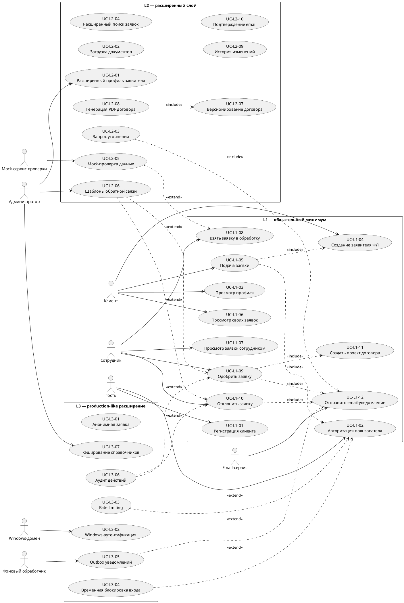
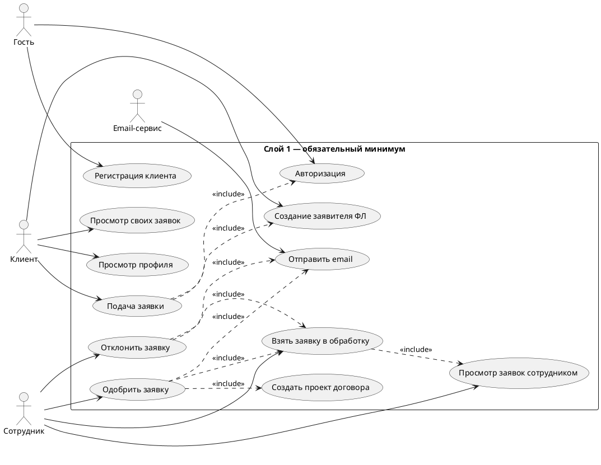

Ниже — **финальный набор use cases**, разложенный по слоям и оформленный в стиле, близком к UML-спецификации:

* **Актор**
* **Действие / цель**
* **Предусловие**
* **Include**
* **Extend / альтернативные сценарии**
* **Основной алгоритм**
* **Постусловие**

Обозначения:

| Обозначение | Значение                                                    |
| ----------- | ----------------------------------------------------------- |
| **L1**      | обязательный первый слой, минимально полноценное приложение |
| **L2**      | расширенный слой для хорошего диплома                       |
| **L3**      | production-like слой / перспективное развитие               |

---

# 1. Акторы системы

| Актор                              |  Слой | Описание                                                        |
| ---------------------------------- | ----: | --------------------------------------------------------------- |
| **Гость**                          |    L1 | Неавторизованный пользователь                                   |
| **Клиент**                         |    L1 | Авторизованный пользователь, подающий заявки                    |
| **Сотрудник**                      |    L1 | Работник компании, обрабатывающий заявки                        |
| **Администратор**                  | L2/L3 | Пользователь, управляющий настройками, справочниками, шаблонами |
| **Email-сервис**                   |    L1 | Сервис отправки email-уведомлений                               |
| **Mock-сервис проверки данных**    |    L2 | Имитация межведомственной проверки                              |
| **Windows-домен**                  |    L3 | Источник Windows-аутентификации сотрудников                     |
| **Фоновый обработчик уведомлений** |    L3 | Обрабатывает outbox и повторную отправку сообщений              |

---

# 2. Общая UML use case diagram

Можно положить в файл:

```text
uml/use-cases/main-use-cases.puml
```



---

# 3. Use cases слоя 1

## UC-L1-01. Регистрация клиента

| Поле            | Описание                                            |
| --------------- | --------------------------------------------------- |
| **Слой**        | L1                                                  |
| **Актор**       | Гость                                               |
| **Действие**    | Зарегистрировать клиентский аккаунт                 |
| **Цель**        | Создать учетную запись для дальнейшей подачи заявок |
| **Предусловие** | Пользователь не авторизован                         |
| **Include**     | Нет                                                 |
| **Extend**      | UC-L2-10 “Подтверждение email”                      |

### Основной алгоритм

1. Гость открывает страницу регистрации.
2. Вводит email, пароль, подтверждение пароля, ФИО и телефон.
3. Клиентская часть выполняет первичную валидацию.
4. Данные отправляются на сервер.
5. Сервер проверяет обязательные поля, формат email, уникальность email.
6. Сервер создает `ClientAccount`.
7. Сервер создает базовый `UserProfile`.
8. Система сообщает об успешной регистрации.

### Альтернативные сценарии

| Вариант | Описание                             |
| ------- | ------------------------------------ |
| **A1**  | Email уже зарегистрирован            |
| **A2**  | Пароль не соответствует требованиям  |
| **A3**  | Не заполнены обязательные поля       |
| **A4**  | Ошибка сервера при создании аккаунта |

### Постусловие

Создан клиентский аккаунт, пользователь может авторизоваться.

---

## UC-L1-02. Авторизация пользователя

| Поле            | Описание                                                        |
| --------------- | --------------------------------------------------------------- |
| **Слой**        | L1                                                              |
| **Актор**       | Гость / Клиент / Сотрудник                                      |
| **Действие**    | Войти в систему                                                 |
| **Цель**        | Получить доступ к функциям согласно роли                        |
| **Предусловие** | Аккаунт существует                                              |
| **Include**     | Нет                                                             |
| **Extend**      | UC-L3-03 “Rate limiting”, UC-L3-04 “Временная блокировка входа” |

### Основной алгоритм

1. Пользователь открывает страницу входа.
2. Вводит email и пароль.
3. Система проверяет учетные данные.
4. Система определяет роль пользователя.
5. Клиент перенаправляется в личный кабинет.
6. Сотрудник перенаправляется в рабочую область обработки заявок.

### Альтернативные сценарии

| Вариант | Описание                                       |
| ------- | ---------------------------------------------- |
| **A1**  | Email не найден                                |
| **A2**  | Пароль неверный                                |
| **A3**  | Аккаунт неактивен                              |
| **A4**  | Пользователь уже авторизован                   |
| **A5**  | Превышено число попыток входа, если включен L3 |

### Постусловие

Пользователь авторизован, сессия создана.

---

## UC-L1-03. Просмотр профиля

| Поле            | Описание                                 |
| --------------- | ---------------------------------------- |
| **Слой**        | L1                                       |
| **Актор**       | Клиент                                   |
| **Действие**    | Просмотреть базовый профиль              |
| **Цель**        | Проверить свои контактные данные         |
| **Предусловие** | Клиент авторизован                       |
| **Include**     | UC-L1-02 “Авторизация пользователя”      |
| **Extend**      | UC-L2-01 “Расширенный профиль заявителя” |

### Основной алгоритм

1. Клиент открывает раздел профиля.
2. Система получает данные текущего пользователя.
3. Система отображает ФИО, email, телефон.
4. Клиент при необходимости обновляет ФИО или телефон.

### Альтернативные сценарии

| Вариант | Описание                     |
| ------- | ---------------------------- |
| **A1**  | Профиль не найден            |
| **A2**  | Ошибка обновления данных     |
| **A3**  | Некорректный формат телефона |

### Постусловие

Клиент видит актуальные данные профиля.

---

## UC-L1-04. Создание заявителя ФЛ

| Поле            | Описание                                 |
| --------------- | ---------------------------------------- |
| **Слой**        | L1                                       |
| **Актор**       | Клиент                                   |
| **Действие**    | Создать `IndividualApplicantParty`       |
| **Цель**        | Указать, от чьего имени подается заявка  |
| **Предусловие** | Клиент авторизован                       |
| **Include**     | UC-L1-02 “Авторизация пользователя”      |
| **Extend**      | UC-L2-01 “Расширенный профиль заявителя” |

### Основной алгоритм

1. Клиент открывает профиль или форму первой заявки.
2. Система предлагает создать заявителя.
3. Клиент вводит ФИО, email, телефон.
4. Система создает `IndividualApplicantParty`.
5. Заявитель связывается с `ClientAccount`.

### Альтернативные сценарии

| Вариант | Описание                        |
| ------- | ------------------------------- |
| **A1**  | Некорректные контактные данные  |
| **A2**  | У клиента уже есть заявитель ФЛ |
| **A3**  | Ошибка сохранения               |

### Постусловие

У клиентского аккаунта есть заявитель типа ФЛ.

---

## UC-L1-05. Подача заявки

| Поле            | Описание                                                              |
| --------------- | --------------------------------------------------------------------- |
| **Слой**        | L1                                                                    |
| **Актор**       | Клиент                                                                |
| **Действие**    | Создать заявку                                                        |
| **Цель**        | Передать обращение в ООО «ЗСК»                                        |
| **Предусловие** | Клиент авторизован, создан `ApplicantParty`                           |
| **Include**     | UC-L1-02 “Авторизация пользователя”, UC-L1-04 “Создание заявителя ФЛ” |
| **Extend**      | UC-L2-02 “Загрузка документов”                                        |

### Основной алгоритм

1. Клиент открывает форму подачи заявки.
2. Выбирает тип заявки:

   * технологическое присоединение;
   * приборы учета.
3. Выбирает заявителя.
4. Указывает адрес объекта.
5. Вводит текст обращения.
6. Система валидирует данные.
7. Система создает `ClientRequest`.
8. Заявка получает статус `Submitted`.
9. Клиент видит сообщение об успешной отправке.

### Альтернативные сценарии

| Вариант | Описание                                          |
| ------- | ------------------------------------------------- |
| **A1**  | Не выбран тип заявки                              |
| **A2**  | Не заполнен адрес объекта                         |
| **A3**  | Текст заявки пустой                               |
| **A4**  | Текст заявки длиннее допустимого лимита           |
| **A5**  | Пользователь пытается подать заявку без заявителя |
| **A6**  | Ошибка сохранения в БД                            |

### Постусловие

Создана заявка со статусом `Submitted`.

---

## UC-L1-06. Просмотр своих заявок

| Поле            | Описание                                  |
| --------------- | ----------------------------------------- |
| **Слой**        | L1                                        |
| **Актор**       | Клиент                                    |
| **Действие**    | Посмотреть список и карточку своих заявок |
| **Цель**        | Отслеживать состояние обращений           |
| **Предусловие** | Клиент авторизован                        |
| **Include**     | UC-L1-02 “Авторизация пользователя”       |
| **Extend**      | UC-L2-09 “История изменений”              |

### Основной алгоритм

1. Клиент открывает раздел “Мои заявки”.
2. Система загружает заявки текущего клиента.
3. Клиент видит номер, тип, дату и статус заявки.
4. Клиент открывает карточку заявки.
5. Система показывает подробные данные заявки и результат рассмотрения.

### Альтернативные сценарии

| Вариант | Описание                             |
| ------- | ------------------------------------ |
| **A1**  | У клиента нет заявок                 |
| **A2**  | Клиент пытается открыть чужую заявку |
| **A3**  | Заявка не найдена                    |

### Постусловие

Клиент получил актуальную информацию по своим заявкам.

---

## UC-L1-07. Просмотр заявок сотрудником

| Поле            | Описание                             |
| --------------- | ------------------------------------ |
| **Слой**        | L1                                   |
| **Актор**       | Сотрудник                            |
| **Действие**    | Просмотреть заявки                   |
| **Цель**        | Получить список заявок для обработки |
| **Предусловие** | Сотрудник авторизован                |
| **Include**     | UC-L1-02 “Авторизация пользователя”  |
| **Extend**      | UC-L2-04 “Расширенный поиск заявок”  |

### Основной алгоритм

1. Сотрудник открывает рабочий раздел.
2. Система отображает вкладки:

   * все заявки;
   * необработанные;
   * обработанные.
3. Сотрудник выбирает нужную вкладку.
4. Система показывает список заявок.
5. Сотрудник открывает карточку заявки.

### Альтернативные сценарии

| Вариант | Описание                                                 |
| ------- | -------------------------------------------------------- |
| **A1**  | Заявок нет                                               |
| **A2**  | Пользователь без роли сотрудника пытается открыть раздел |
| **A3**  | Ошибка загрузки списка                                   |

### Постусловие

Сотрудник видит список заявок и может перейти к обработке.

---

## UC-L1-08. Взять заявку в обработку

| Поле            | Описание                                                      |
| --------------- | ------------------------------------------------------------- |
| **Слой**        | L1                                                            |
| **Актор**       | Сотрудник                                                     |
| **Действие**    | Перевести заявку в обработку                                  |
| **Цель**        | Зафиксировать начало рассмотрения                             |
| **Предусловие** | Сотрудник авторизован, заявка находится в статусе `Submitted` |
| **Include**     | UC-L1-07 “Просмотр заявок сотрудником”                        |
| **Extend**      | UC-L2-09 “История изменений”                                  |

### Основной алгоритм

1. Сотрудник открывает карточку заявки.
2. Нажимает “Взять в обработку”.
3. Система проверяет текущий статус заявки.
4. Система присваивает заявке сотрудника.
5. Статус меняется на `InReview`.

### Альтернативные сценарии

| Вариант | Описание                              |
| ------- | ------------------------------------- |
| **A1**  | Заявка уже обработана                 |
| **A2**  | Заявка уже взята другим сотрудником   |
| **A3**  | Пользователь не имеет роли сотрудника |

### Постусловие

Заявка находится в статусе `InReview`.

---

## UC-L1-09. Одобрить заявку

| Поле            | Описание                                                                   |
| --------------- | -------------------------------------------------------------------------- |
| **Слой**        | L1                                                                         |
| **Актор**       | Сотрудник                                                                  |
| **Действие**    | Одобрить заявку                                                            |
| **Цель**        | Принять положительное решение по заявке                                    |
| **Предусловие** | Заявка находится в статусе `InReview`                                      |
| **Include**     | UC-L1-11 “Создать проект договора”, UC-L1-12 “Отправить email-уведомление” |
| **Extend**      | UC-L2-06 “Шаблоны обратной связи”, UC-L2-05 “Mock-проверка данных”         |

### Основной алгоритм

1. Сотрудник вручную проверяет данные заявки.
2. Вводит комментарий.
3. Нажимает “Одобрить”.
4. Система создает `RequestReview` с решением `Approved`.
5. Система меняет статус заявки на `Approved`.
6. Система создает простой `ContractDraft`.
7. Система отправляет email клиенту.
8. Заявка получает статус `ContractDraftSent`.

### Альтернативные сценарии

| Вариант | Описание                               |
| ------- | -------------------------------------- |
| **A1**  | Заявка не находится в обработке        |
| **A2**  | Комментарий пустой, если он обязателен |
| **A3**  | Ошибка создания проекта договора       |
| **A4**  | Ошибка отправки email                  |
| **A5**  | Заявка уже была обработана ранее       |

### Постусловие

Заявка одобрена, проект договора создан, клиент получил обратную связь.

---

## UC-L1-10. Отклонить заявку

| Поле            | Описание                               |
| --------------- | -------------------------------------- |
| **Слой**        | L1                                     |
| **Актор**       | Сотрудник                              |
| **Действие**    | Отклонить заявку                       |
| **Цель**        | Зафиксировать отказ по заявке          |
| **Предусловие** | Заявка находится в статусе `InReview`  |
| **Include**     | UC-L1-12 “Отправить email-уведомление” |
| **Extend**      | UC-L2-06 “Шаблоны обратной связи”      |

### Основной алгоритм

1. Сотрудник открывает заявку.
2. Указывает причину отказа.
3. Нажимает “Отклонить”.
4. Система создает `RequestReview` с решением `Rejected`.
5. Система меняет статус заявки на `Rejected`.
6. Система отправляет email клиенту с причиной отказа.

### Альтернативные сценарии

| Вариант | Описание                  |
| ------- | ------------------------- |
| **A1**  | Причина отказа не указана |
| **A2**  | Заявка уже обработана     |
| **A3**  | Ошибка отправки email     |
| **A4**  | Недостаточно прав         |

### Постусловие

Заявка отклонена, клиент уведомлен по email.

---

## UC-L1-11. Создать проект договора

| Поле            | Описание                                                               |
| --------------- | ---------------------------------------------------------------------- |
| **Слой**        | L1                                                                     |
| **Актор**       | Система / Сотрудник                                                    |
| **Действие**    | Создать простой проект договора                                        |
| **Цель**        | Сформировать документ по одобренной заявке                             |
| **Предусловие** | Заявка одобрена                                                        |
| **Include**     | UC-L1-09 “Одобрить заявку”                                             |
| **Extend**      | UC-L2-07 “Версионирование договора”, UC-L2-08 “Генерация PDF договора” |

### Основной алгоритм

1. Система получает данные заявки.
2. Система формирует простой текст проекта договора.
3. Создается `ContractDraft`.
4. Проект договора связывается с заявкой.
5. При наличии PDF-файла путь сохраняется в `ContractDraft`.

### Альтернативные сценарии

| Вариант | Описание                          |
| ------- | --------------------------------- |
| **A1**  | Для заявки нельзя создать договор |
| **A2**  | Ошибка генерации текста           |
| **A3**  | Ошибка сохранения договора        |

### Постусловие

Проект договора создан и связан с заявкой.

---

## UC-L1-12. Отправить email-уведомление

| Поле            | Описание                                    |
| --------------- | ------------------------------------------- |
| **Слой**        | L1                                          |
| **Актор**       | Система / Email-сервис                      |
| **Действие**    | Отправить email клиенту                     |
| **Цель**        | Сообщить клиенту результат обработки заявки |
| **Предусловие** | Есть email клиента и текст сообщения        |
| **Include**     | Нет                                         |
| **Extend**      | UC-L3-05 “Outbox уведомлений”               |

### Основной алгоритм

1. Система формирует тему письма.
2. Система формирует тело письма.
3. Создается `EmailNotification`.
4. Email-сервис отправляет письмо.
5. Система фиксирует статус отправки.

### Альтернативные сценарии

| Вариант | Описание                        |
| ------- | ------------------------------- |
| **A1**  | Email отсутствует               |
| **A2**  | Email имеет некорректный формат |
| **A3**  | Email-сервис недоступен         |
| **A4**  | Письмо не отправлено            |

### Постусловие

Клиент получил email либо система зафиксировала ошибку отправки.

---

# 4. Use cases слоя 2

## UC-L2-01. Расширенный профиль заявителя

| Поле            | Описание                               |
| --------------- | -------------------------------------- |
| **Слой**        | L2                                     |
| **Актор**       | Клиент                                 |
| **Действие**    | Заполнить расширенные данные заявителя |
| **Цель**        | Поддержать ФЛ, ИП и ЮЛ                 |
| **Предусловие** | Клиент авторизован                     |
| **Include**     | UC-L1-02 “Авторизация пользователя”    |
| **Extend**      | UC-L1-04 “Создание заявителя ФЛ”       |

### Основной алгоритм

1. Клиент выбирает тип заявителя: ФЛ, ИП или ЮЛ.
2. Вводит соответствующие данные:

   * ФЛ: паспорт;
   * ИП: ИНН, ОГРНИП;
   * ЮЛ: ИНН, ОГРН, наименование.
3. Система валидирует данные.
4. Система сохраняет `ApplicantParty`.
5. При создании заявки система формирует `ApplicantSnapshot`.

### Постусловие

В системе есть расширенные данные заявителя.

---

## UC-L2-02. Загрузка документов к заявке

| Поле            | Описание                        |
| --------------- | ------------------------------- |
| **Слой**        | L2                              |
| **Актор**       | Клиент / Сотрудник              |
| **Действие**    | Прикрепить документ             |
| **Цель**        | Вести документооборот по заявке |
| **Предусловие** | Заявка существует               |
| **Include**     | UC-L1-05 “Подача заявки”        |
| **Extend**      | UC-L2-05 “Mock-проверка данных” |

### Основной алгоритм

1. Пользователь открывает заявку.
2. Выбирает тип документа.
3. Загружает файл.
4. Система проверяет формат и размер.
5. Система сохраняет файл и метаданные.
6. Документ связывается с заявкой.

### Альтернативные сценарии

| Вариант | Описание                               |
| ------- | -------------------------------------- |
| **A1**  | Файл слишком большой                   |
| **A2**  | Формат не разрешен                     |
| **A3**  | Ошибка сохранения файла                |
| **A4**  | Пользователь не имеет доступа к заявке |

### Постусловие

Документ прикреплен к заявке.

---

## UC-L2-03. Запрос уточнения

| Поле            | Описание                                                               |
| --------------- | ---------------------------------------------------------------------- |
| **Слой**        | L2                                                                     |
| **Актор**       | Сотрудник                                                              |
| **Действие**    | Запросить уточнение данных                                             |
| **Цель**        | Не отклонять заявку сразу, а дать клиенту возможность исправить данные |
| **Предусловие** | Заявка находится в обработке                                           |
| **Include**     | UC-L1-12 “Отправить email-уведомление”                                 |
| **Extend**      | UC-L2-06 “Шаблоны обратной связи”                                      |

### Основной алгоритм

1. Сотрудник открывает заявку.
2. Выявляет недостающие или некорректные данные.
3. Вводит комментарий.
4. Система создает `RequestReview` с решением `NeedClarification`.
5. Статус заявки меняется на `NeedClarification`.
6. Клиент получает email.

### Постусловие

Заявка ожидает уточнения от клиента.

---

## UC-L2-04. Расширенный поиск и фильтрация заявок

| Поле            | Описание                                       |
| --------------- | ---------------------------------------------- |
| **Слой**        | L2                                             |
| **Актор**       | Сотрудник                                      |
| **Действие**    | Найти заявку по параметрам                     |
| **Цель**        | Упростить обработку большого количества заявок |
| **Предусловие** | Сотрудник авторизован                          |
| **Include**     | UC-L1-07 “Просмотр заявок сотрудником”         |
| **Extend**      | Нет                                            |

### Основной алгоритм

1. Сотрудник открывает список заявок.
2. Указывает фильтры:

   * статус;
   * тип заявки;
   * тип заявителя;
   * период;
   * email / ФИО;
   * наличие документов.
3. Система возвращает отфильтрованный список.

### Постусловие

Сотрудник получает список заявок по заданным условиям.

---

## UC-L2-05. Mock-проверка данных

| Поле            | Описание                                                            |
| --------------- | ------------------------------------------------------------------- |
| **Слой**        | L2                                                                  |
| **Актор**       | Сотрудник / Mock-сервис проверки данных                             |
| **Действие**    | Имитировать проверку данных заявителя                               |
| **Цель**        | Показать сценарий межведомственной проверки без реальной интеграции |
| **Предусловие** | Заявка находится в обработке                                        |
| **Include**     | UC-L1-08 “Взять заявку в обработку”                                 |
| **Extend**      | UC-L1-09 “Одобрить заявку”, UC-L2-03 “Запрос уточнения”             |

### Основной алгоритм

1. Сотрудник нажимает “Проверить данные”.
2. Система создает `VerificationRequest`.
3. Mock-сервис выполняет условную проверку:

   * паспорта;
   * ИНН;
   * ОГРН/ОГРНИП;
   * адреса;
   * обязательных документов.
4. Система получает `VerificationResult`.
5. Результат отображается сотруднику.

### Альтернативные сценарии

| Вариант | Описание                        |
| ------- | ------------------------------- |
| **A1**  | Mock-сервис недоступен          |
| **A2**  | Часть данных не прошла проверку |
| **A3**  | Требуется ручная проверка       |
| **A4**  | Проверка уже выполнялась        |

### Постусловие

Результат проверки сохранен и доступен в карточке заявки.

---

## UC-L2-06. Использование шаблона обратной связи

| Поле            | Описание                                           |
| --------------- | -------------------------------------------------- |
| **Слой**        | L2                                                 |
| **Актор**       | Сотрудник                                          |
| **Действие**    | Выбрать шаблон ответа                              |
| **Цель**        | Ускорить подготовку комментариев и email-сообщений |
| **Предусловие** | Есть активные шаблоны                              |
| **Include**     | UC-L1-09 / UC-L1-10 / UC-L2-03                     |
| **Extend**      | Нет                                                |

### Основной алгоритм

1. Сотрудник выбирает действие: одобрить, отклонить или запросить уточнение.
2. Система показывает подходящие шаблоны.
3. Сотрудник выбирает шаблон.
4. Система подставляет данные заявки.
5. Сотрудник редактирует текст при необходимости.
6. Текст используется в решении и email.

### Постусловие

Решение сформировано на основе шаблона.

---

## UC-L2-07. Версионирование проекта договора

| Поле            | Описание                              |
| --------------- | ------------------------------------- |
| **Слой**        | L2                                    |
| **Актор**       | Сотрудник                             |
| **Действие**    | Создать новую версию проекта договора |
| **Цель**        | Хранить историю изменений договора    |
| **Предусловие** | По заявке есть `ContractDraft`        |
| **Include**     | UC-L1-11 “Создать проект договора”    |
| **Extend**      | UC-L2-08 “Генерация PDF договора”     |

### Основной алгоритм

1. Сотрудник открывает проект договора.
2. Вносит изменения.
3. Система создает новую `ContractDraftVersion`.
4. Новая версия становится текущей.
5. Событие фиксируется в истории договора.

### Постусловие

Создана новая версия проекта договора.

---

## UC-L2-08. Генерация PDF договора

| Поле            | Описание                                          |
| --------------- | ------------------------------------------------- |
| **Слой**        | L2                                                |
| **Актор**       | Сотрудник / Система                               |
| **Действие**    | Сформировать PDF-файл договора                    |
| **Цель**        | Получить документ, пригодный для отправки клиенту |
| **Предусловие** | Есть текст или шаблон договора                    |
| **Include**     | UC-L2-07 “Версионирование проекта договора”       |
| **Extend**      | UC-L1-12 “Отправить email-уведомление”            |

### Основной алгоритм

1. Система получает текущую версию договора.
2. Подставляет данные заявки и заявителя.
3. Генерирует PDF.
4. Сохраняет файл.
5. Создает `GeneratedDocument`.
6. PDF прикрепляется к заявке.

### Альтернативные сценарии

| Вариант | Описание                        |
| ------- | ------------------------------- |
| **A1**  | Нет шаблона                     |
| **A2**  | Не хватает данных для генерации |
| **A3**  | Ошибка генератора PDF           |
| **A4**  | Ошибка сохранения файла         |

### Постусловие

PDF-договор создан и связан с заявкой.

---

## UC-L2-09. История изменений заявки

| Поле            | Описание                               |
| --------------- | -------------------------------------- |
| **Слой**        | L2                                     |
| **Актор**       | Система / Клиент / Сотрудник           |
| **Действие**    | Фиксировать действия по заявке         |
| **Цель**        | Обеспечить прозрачность обработки      |
| **Предусловие** | Выполняется действие над заявкой       |
| **Include**     | UC-L1-05, UC-L1-08, UC-L1-09, UC-L1-10 |
| **Extend**      | UC-L3-06 “Аудит действий”              |

### Основной алгоритм

1. Пользователь выполняет действие с заявкой.
2. Система определяет тип действия.
3. Создается `RequestHistoryEntry`.
4. История отображается в карточке заявки.

### Постусловие

Действие сохранено в истории заявки.

---

## UC-L2-10. Подтверждение email

| Поле            | Описание                                                               |
| --------------- | ---------------------------------------------------------------------- |
| **Слой**        | L2                                                                     |
| **Актор**       | Клиент / Email-сервис                                                  |
| **Действие**    | Подтвердить email                                                      |
| **Цель**        | Убедиться, что клиент владеет указанной почтой                         |
| **Предусловие** | Клиент зарегистрирован                                                 |
| **Include**     | UC-L1-01 “Регистрация клиента”, UC-L1-12 “Отправить email-уведомление” |
| **Extend**      | Нет                                                                    |

### Основной алгоритм

1. После регистрации система создает токен подтверждения.
2. Система отправляет письмо клиенту.
3. Клиент переходит по ссылке.
4. Система проверяет токен.
5. Email помечается как подтвержденный.

### Постусловие

Email клиента подтвержден.

---

# 5. Use cases слоя 3

## UC-L3-01. Анонимная заявка

| Поле            | Описание                                         |
| --------------- | ------------------------------------------------ |
| **Слой**        | L3                                               |
| **Актор**       | Гость                                            |
| **Действие**    | Подать заявку без аккаунта                       |
| **Цель**        | Снизить порог подачи обращения                   |
| **Предусловие** | Пользователь не авторизован                      |
| **Include**     | UC-L1-05 “Подача заявки”                         |
| **Extend**      | UC-L1-04 заменяется на `AnonymousApplicantParty` |

### Основной алгоритм

1. Гость открывает форму заявки.
2. Указывает контактные данные.
3. Выбирает тип заявки.
4. Заполняет текст и адрес.
5. Система создает `AnonymousApplicantParty`.
6. Система создает заявку без привязки к аккаунту.
7. Обратная связь идет только по email.

### Постусловие

Заявка создана без аккаунта клиента.

---

## UC-L3-02. Windows-аутентификация сотрудника

| Поле            | Описание                                      |
| --------------- | --------------------------------------------- |
| **Слой**        | L3                                            |
| **Актор**       | Сотрудник / Windows-домен                     |
| **Действие**    | Войти через доменную учетную запись           |
| **Цель**        | Упростить вход сотрудников во внутренней сети |
| **Предусловие** | Сотрудник находится в корпоративной сети      |
| **Include**     | UC-L1-02 “Авторизация пользователя”           |
| **Extend**      | Нет                                           |

### Основной алгоритм

1. Сотрудник открывает внутренний адрес приложения.
2. Сервер выполняет Negotiate-аутентификацию.
3. Система получает Windows-логин.
4. Система ищет `WindowsIdentityLink`.
5. Сотрудник авторизуется без ввода пароля.

### Постусловие

Сотрудник вошел через Windows-аутентификацию.

---

## UC-L3-03. Rate limiting

| Поле            | Описание                                           |
| --------------- | -------------------------------------------------- |
| **Слой**        | L3                                                 |
| **Актор**       | Система                                            |
| **Действие**    | Ограничить частоту запросов                        |
| **Цель**        | Защитить регистрацию, вход и восстановление пароля |
| **Предусловие** | Пользователь выполняет чувствительный запрос       |
| **Include**     | UC-L1-02 “Авторизация пользователя”                |
| **Extend**      | UC-L3-04 “Временная блокировка входа”              |

### Основной алгоритм

1. Пользователь выполняет запрос входа.
2. Система определяет ключ ограничения: IP, email или email+IP.
3. Система проверяет число попыток за период.
4. Если лимит не превышен, запрос выполняется.
5. Если лимит превышен, система возвращает ошибку.

### Постусловие

Частота запросов ограничена.

---

## UC-L3-04. Временная блокировка входа

| Поле            | Описание                                                         |
| --------------- | ---------------------------------------------------------------- |
| **Слой**        | L3                                                               |
| **Актор**       | Система / Email-сервис                                           |
| **Действие**    | Заблокировать вход после серии неудачных попыток                 |
| **Цель**        | Защитить аккаунт от перебора пароля                              |
| **Предусловие** | Зафиксировано несколько неудачных попыток                        |
| **Include**     | UC-L3-03 “Rate limiting”, UC-L1-12 “Отправить email-уведомление” |
| **Extend**      | Нет                                                              |

### Основной алгоритм

1. Пользователь несколько раз вводит неверный пароль.
2. Система фиксирует `LoginAttempt`.
3. После превышения лимита создается `AccountLock`.
4. Пользователь временно не может войти.
5. Система отправляет email о подозрительной активности.

### Постусловие

Вход временно заблокирован.

---

## UC-L3-05. Outbox уведомлений

| Поле            | Описание                               |
| --------------- | -------------------------------------- |
| **Слой**        | L3                                     |
| **Актор**       | Фоновый обработчик / Email-сервис      |
| **Действие**    | Надежно отправить уведомление          |
| **Цель**        | Не терять email при сбоях              |
| **Предусловие** | Создано уведомление                    |
| **Include**     | UC-L1-12 “Отправить email-уведомление” |
| **Extend**      | Нет                                    |

### Основной алгоритм

1. Система создает `OutboxMessage`.
2. Фоновый обработчик читает pending-сообщения.
3. Пытается отправить email.
4. При успехе помечает сообщение как отправленное.
5. При ошибке увеличивает счетчик попыток.

### Постусловие

Уведомление отправлено либо ожидает повторной отправки.

---

## UC-L3-06. Аудит действий

| Поле            | Описание                                 |
| --------------- | ---------------------------------------- |
| **Слой**        | L3                                       |
| **Актор**       | Система                                  |
| **Действие**    | Записать значимое действие пользователя  |
| **Цель**        | Обеспечить трассируемость действий       |
| **Предусловие** | Пользователь выполняет значимое действие |
| **Include**     | UC-L2-09 “История изменений заявки”      |
| **Extend**      | Нет                                      |

### Основной алгоритм

1. Пользователь выполняет действие.
2. Система определяет тип действия и сущность.
3. Система создает `AuditLogEntry`.
4. Запись сохраняется независимо от UI.

### Постусловие

Действие зафиксировано в аудите.

---

## UC-L3-07. Кэширование справочников

| Поле            | Описание                                           |
| --------------- | -------------------------------------------------- |
| **Слой**        | L3                                                 |
| **Актор**       | Система / Администратор                            |
| **Действие**    | Кэшировать редко меняющиеся справочники            |
| **Цель**        | Снизить нагрузку на БД                             |
| **Предусловие** | Используются справочники статусов, типов, шаблонов |
| **Include**     | Нет                                                |
| **Extend**      | Нет                                                |

### Основной алгоритм

1. Система запрашивает справочник.
2. Проверяет наличие данных в кэше.
3. Если данные есть, возвращает их из кэша.
4. Если данных нет, загружает из БД.
5. Сохраняет результат в кэше.

### Постусловие

Справочник получен с минимальной нагрузкой на БД.

---

# 6. Минимальный UML для слоя 1

Если нужен отдельный простой файл только для первого слоя:

```text
uml/use-cases/layer-1-use-cases.puml
```



---

# 7. Итоговая граница реализации

## Реализовать обязательно в L1

```text
UC-L1-01 Регистрация клиента
UC-L1-02 Авторизация пользователя
UC-L1-03 Просмотр профиля
UC-L1-04 Создание заявителя ФЛ
UC-L1-05 Подача заявки
UC-L1-06 Просмотр своих заявок
UC-L1-07 Просмотр заявок сотрудником
UC-L1-08 Взять заявку в обработку
UC-L1-09 Одобрить заявку
UC-L1-10 Отклонить заявку
UC-L1-11 Создать проект договора
UC-L1-12 Отправить email-уведомление
```

## Добавить в L2 для хорошего диплома

```text
UC-L2-01 Расширенный профиль заявителя
UC-L2-02 Загрузка документов
UC-L2-03 Запрос уточнения
UC-L2-04 Расширенный поиск заявок
UC-L2-05 Mock-проверка данных
UC-L2-06 Шаблоны обратной связи
UC-L2-07 Версионирование договора
UC-L2-08 Генерация PDF договора
UC-L2-09 История изменений
UC-L2-10 Подтверждение email
```

## Оставить как L3 / перспективу

```text
UC-L3-01 Анонимная заявка
UC-L3-02 Windows-аутентификация
UC-L3-03 Rate limiting
UC-L3-04 Временная блокировка входа
UC-L3-05 Outbox уведомлений
UC-L3-06 Аудит действий
UC-L3-07 Кэширование справочников
```

Для старта разработки лучше прямо сейчас сделать файл `uml/use-cases/layer-1-use-cases.puml` и отдельно `docs/diploma/use-cases.md`, куда вставить эти спецификации.
